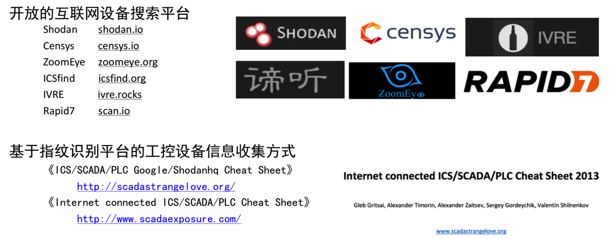
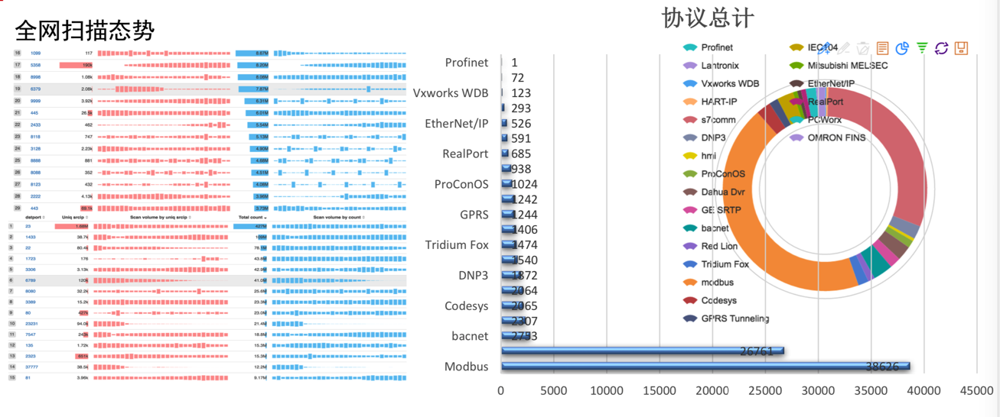
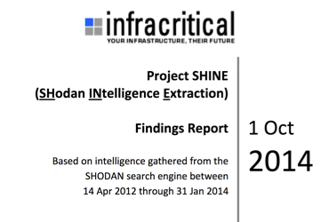
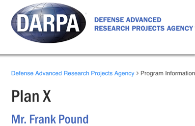
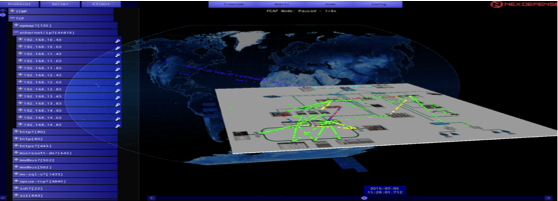
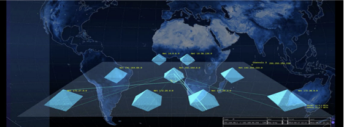
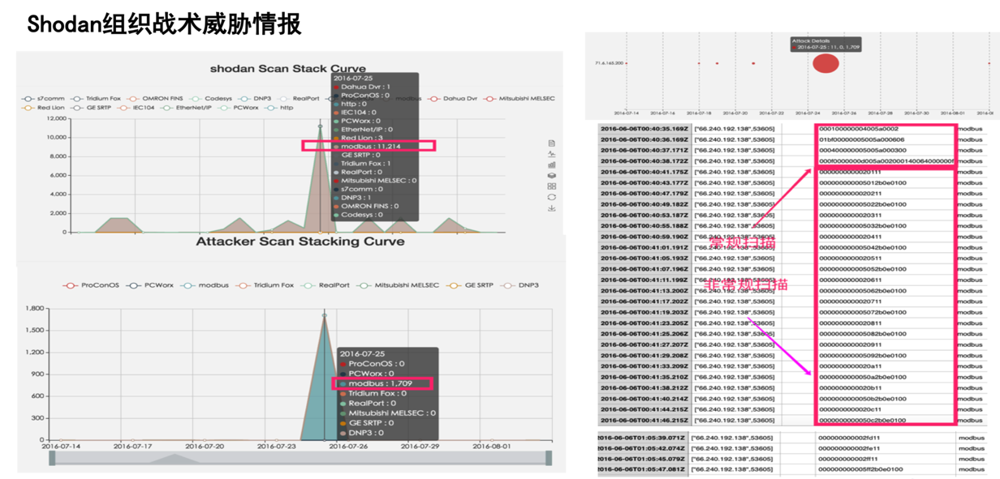

# 工控设备扫描

## 概述

各类漏洞引擎内容不同，采取配置、部署节点等存在较大的差异，目前针对工控这块的搜索引擎以 `shodan` 和 `ditecting` 更为专业，但是从针对端口来看，各个引擎宣称的公布检索方式不尽相同。

举例：

全网扫描和相关工控协议

## 国外针对网络空间的情报收集计划

* SHINE计划——Project Shodan Intelligence Extraction
  * 
* X-Plane
  * 
* Treasure Map
* NCR

## 扫描后

### 绘制网络空间地图，构建上帝视角感知能力

一般扫描出设备和风险、漏洞、威胁后，为了便于直观理解，往往会去绘制空间图。

### 出情报

扫描后，就可以给出总结报告，情报了：

