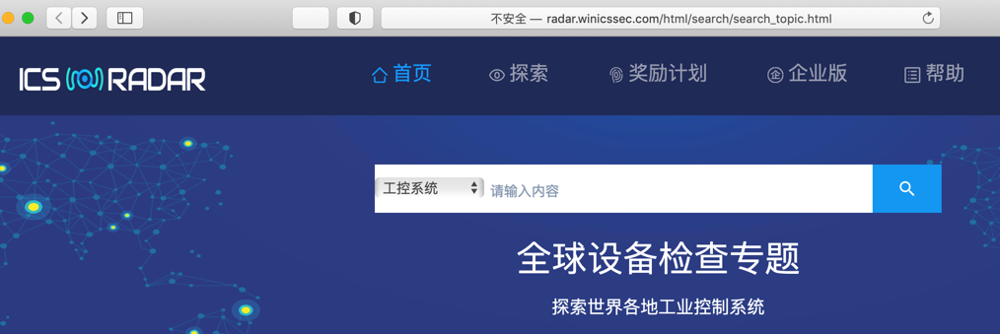
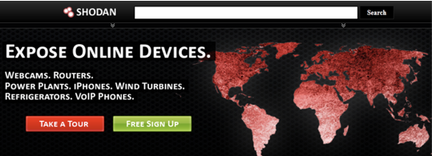
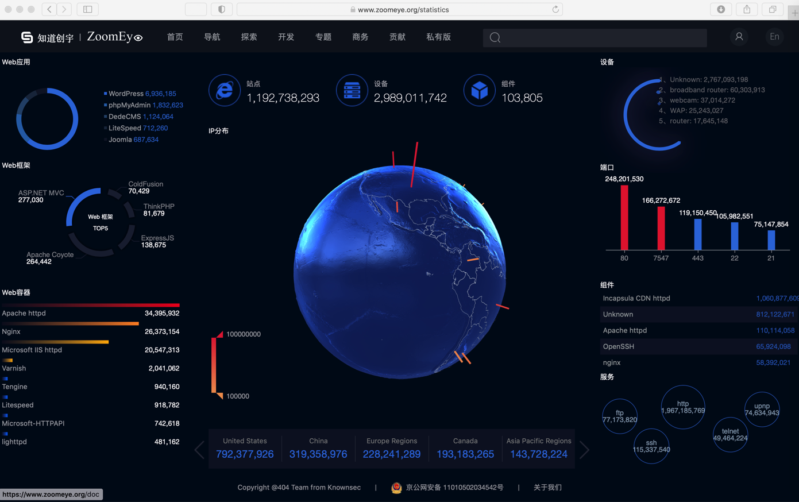

# 工控安全全球检索网站和系统

* ICS-Radar
  * http://radar.winicssec.com/html/search/search_topic.html
    * 
* Shodan搜索
  * https://www.shodan.io
    * 
    * 
  * 举例
    * 
* Zoomeye搜索
  * 概述
    * 知道创宇打造的面向网络空间的搜索引擎
    * ZoomEye 于 2015 年 3 月上线了工控专题 (http://ics.zoomeye.org)，ZoomEye 支持 12 种工控协议的数据检索，使用者也可以使用工控协议的端口和特征 Dork 关键字发现暴露在互联网的工控软硬件
    * 对于工控协议类型的数据，ZoomEye 启用了保护策略，一般用户无法直接查看
  * ZoomEye - Cyberspace Search Engine
    * https://www.zoomeye.org
      * 
  * ZoomEye - Cyberspace Search Engine
    * https://www.zoomeye.org/statistics
      * 
  * 举例
    * 
* FOFA 引擎
  * 概述
    * FOFA 是白帽汇推出的一款网络空间资产搜索引擎。它能够帮助用户迅速进行网络资产匹配、加快后续工作进程。
      * 例如进行漏洞影响范围分析、应用分布统计、应用流行度排名统计等
* Diting 全网引擎
  * 概述
    * 谛听 (ditecting) 网络空间工控设备搜索引擎，取谛听辨识万物之意，意在搜寻暴露在互联网上的工业控制系统联网设备， 帮助安全厂家维护工控系统安全、循迹恶意企图人士
  * 主页
    * 谛听 - 专注工控安全的搜索引擎
      * http://www.ditecting.com
        * 
* Censys 全网引擎
  * 概述
    * Censys 是一款搜索引擎，它允许计算机科学家了解组成互联网的设备和网络。
    * Censys 由因特网范围扫描驱动，它使得研究人员能够找到特定的主机，并能够针将设备、网站和证书的配置和部署信息创建到一个总体报告中
