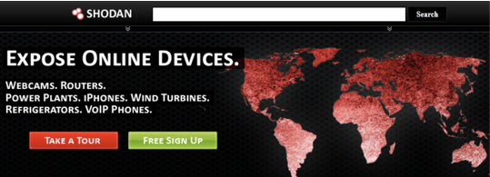
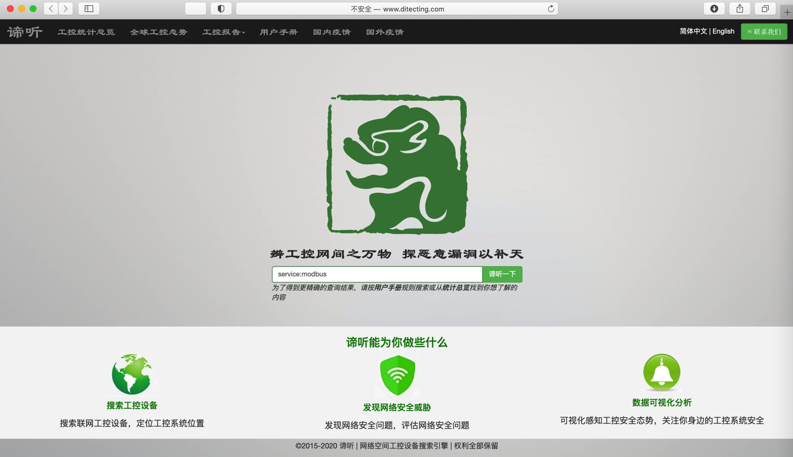
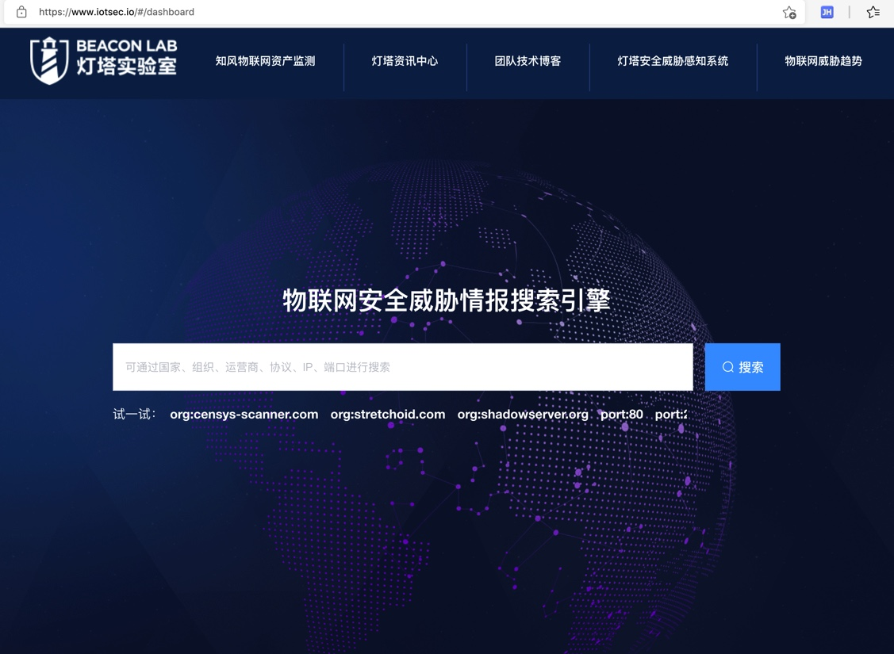
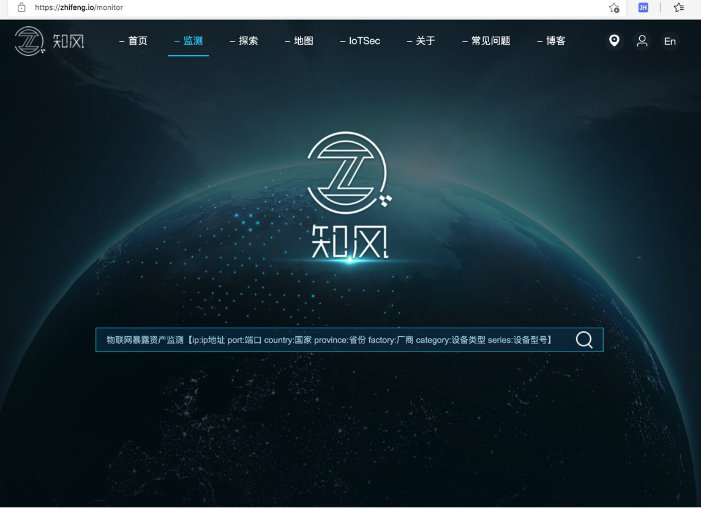

# 工控设备扫描系统

* 常见的`工控设备扫描系统`=`开放式网络空间搜索引擎`
  * ICS-Radar
    * http://radar.winicssec.com/html/search/search_topic.html
      * 
  * Shodan搜索
    * https://www.shodan.io
      * 
      * 
    * 举例
      * 
  * Censys 全网引擎
    * 概述
      * Censys 是一款搜索引擎，它允许计算机科学家了解组成互联网的设备和网络。
      * Censys 由因特网范围扫描驱动，它使得研究人员能够找到特定的主机，并能够针将设备、网站和证书的配置和部署信息创建到一个总体报告中
  * Zoomeye搜索
    * 概述
      * 知道创宇打造的面向网络空间的搜索引擎
      * ZoomEye 于 2015 年 3 月上线了工控专题 (http://ics.zoomeye.org)，ZoomEye 支持 12 种工控协议的数据检索，使用者也可以使用工控协议的端口和特征 Dork 关键字发现暴露在互联网的工控软硬件
      * 对于工控协议类型的数据，ZoomEye 启用了保护策略，一般用户无法直接查看
    * ZoomEye - Cyberspace Search Engine
      * https://www.zoomeye.org
        * 
    * ZoomEye - Cyberspace Search Engine
      * https://www.zoomeye.org/statistics
        * 
    * 举例
      * 
  * FOFA 引擎
    * 概述
      * FOFA 是白帽汇推出的一款网络空间资产搜索引擎。它能够帮助用户迅速进行网络资产匹配、加快后续工作进程。
        * 例如进行漏洞影响范围分析、应用分布统计、应用流行度排名统计等
  * Diting 全网引擎
    * 概述
      * 谛听 (ditecting) 网络空间工控设备搜索引擎，取谛听辨识万物之意，意在搜寻暴露在互联网上的工业控制系统联网设备， 帮助安全厂家维护工控系统安全、循迹恶意企图人士
    * 主页
      * 谛听 - 专注工控安全的搜索引擎
        * http://www.ditecting.com
          * 
  * iotsec
    * 灯塔实验室 - 物联网安全威胁情报搜索引擎
      * https://www.iotsec.io
        * IoTSec.io-开放式物联网安全威胁情报搜索引擎
          * IoTSec.io是由灯塔实验室研发与运营的开放式物联网安全威胁情报搜索引擎，IoTSec.io由一个分布式互联网背景流量分析引擎组成，IoTSec.io可以实时收集与分析互联网海量网络流量行为，并且能够对网络流量行为、互联网传播的流量载荷、攻击事件进行自动化分析
          * IoTSec.io目前是一个完全开放式的数据搜索引擎，任何人都可以使用IoTSec.io来了解当前网络安全态势，通过使用IoTSec.io可以：
            * 1、掌握与监控各类网络扫描组织和网络空间测绘引擎行为
            * 2、掌握与监控各类网络扫描组织与扫描IP节点运行情况、扫描节点扫描的通信协议行为
            * 3、掌握与监控当前互联网扫描端口动态趋势
            * 4、掌握与监控当前互联网应用层载荷传播与排行情况
            * 5、掌握与监控当前互联网各类自动化漏洞利用情况
            * 6、掌握与监控当前物联网、工控系统相关被扫描、被攻击安全情况
        * 截图
          * 
  * 知风
    * 知风-互联网联网工控资产与企业分析系统
      * https://zhifeng.io/monitor
        * 是什么：互联网联网工控资产与企业的关联分析系统
        * 用途：您可搜索任何企业名称来了解该企业是否存在接入互联网的工控系统和资产类型，您也可以搜索特定的系统名称来了解该系统是否接入过互联网
        * 背景
          * 随着网络化和信息化的普及，越来越多工业企业为满足运营、数据通信和运维需求，将工控网络与信息网络相连接，某些特殊情况下甚至直接将工业控制系统接入互联网中。经工业信息安全权威机构统计，我国存在大量工业控制相关软硬件资产直接接入互联网的情况，随着网络空间搜索引擎的出现和工控协议、设备识别方法的公开，使得人们可以利用Shodan、Censys、ZoomEye等开放式网络空间搜索引擎直接检索和访问联网的工业控制设备和系统，同样间接的暴露针对企业和相关系统的攻击面
          * 目前大量工业企业可能由于企业规模、建设规划、系统集成、管理运维、生产运营等多种原因可能将工控系统接入互联网，而其中原因可能是企业网络运维人员自身也不了解的，而“知风”积累的海量数据将可以告诉用户，自己的系统和企业是否曾经接入互联网，以便评估是否是由未授权导致的系统接入互联网
        * 概述
          * “知风”提出了一种互联网联网工控资产自动化分析方式，基于分析结果将可真正帮助用户了解目前接入互联网的工控资产是何企业所属，接入时间，系统名称等。利用“知风”积累的企业和系统数据，您使用“知风”时只需输入企业简称或系统简称，即可了解目标系统企业和系统是否有工控资产联网情况，借助“知风”您也可以了解您的企业、系统是否存在遭受互联网攻击的可能。
        * 系统工作方式
          * “知风”数据跨度长达3年，其系统分析的最原始联网工控资产数据来源渠道主要来自于各种网络空间搜索引擎如Shodan、Censys、ZoomEye、FOFA等公开平台，我们通过独有的IP核查与关联分析技术来鉴定联网工控资产、系统的所属，对系统和企业进行标识。“知风”系统本身是一个“被动”，“非接触式”的综合分析数据管理系统，整体依托开放平台提供的原始数据展开关联分析
      * 截图
        * 
