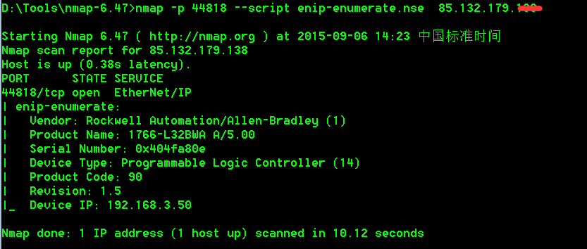
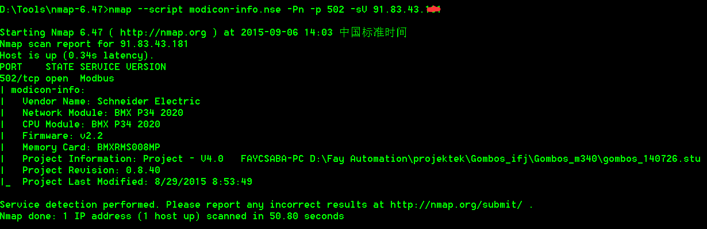
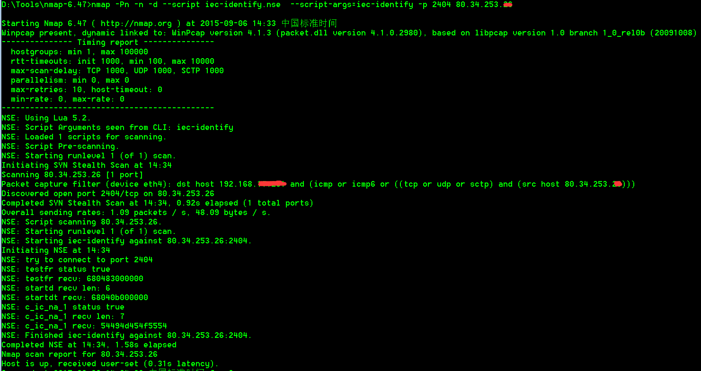
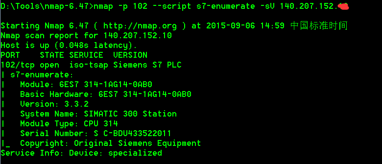
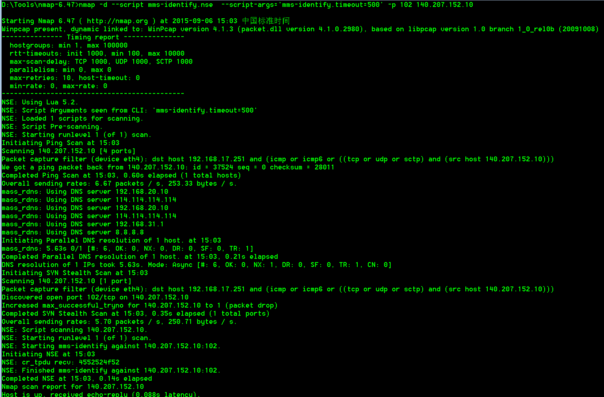
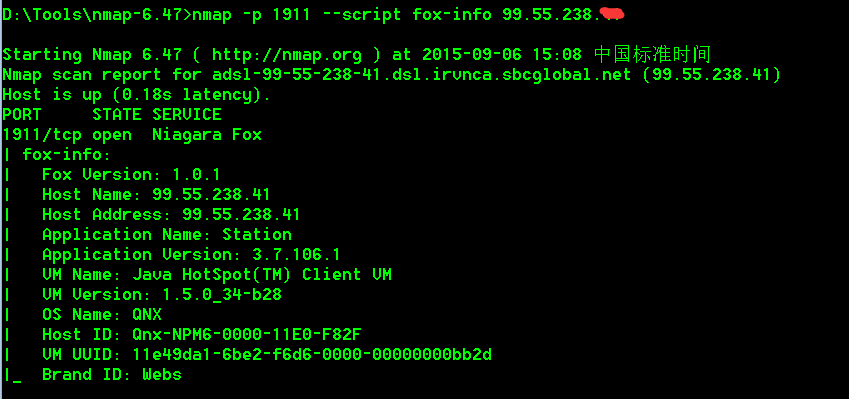

# nmap的nse脚本

* NSE脚本
  * 是什么：nmap的扫描测试脚本
  * 作用
    * 用于扫码相关协议的设备
  * 意义
    * 定位工控系统及协议模块
    * 收集目标工控的信息，如版本、内网IP、模块、硬件信息等
    * 结合对应的NSE脚本进一步拓展，例如自定义空间搜素引擎
  * 资源
    * Github测试脚本
      * https://github.com/atimorin/scada-tools
      * https://github.com/atimorin/PoC2013
      * https://github.com/drainware/scada-tools
      * https://github.com/drainware/nmap-scada
    * Exploit-db测试脚本
      * https://www.exploit-db.com/exploits/19833/
      * https://www.exploit-db.com/exploits/19832/
      * https://www.exploit-db.com/exploits/19831/
      * https://www.exploit-db.com/search/?action=search&description=scada&e_author=

## Nmap NSE脚本

| Nmap NSE脚本 | 端口 | 插件信息 |
| ----------- | ---- | ------ |
| mms-identify.nse | 102 | iec-61850-8-1 (mms) ics protocol |
| s7-enumerate.nse | 102 | numerates Siemens S7 PLC Devices and collects their device information |
| modbus-discover.nse | 502 | Enumerates SCADA Modbus slave ids (sids) and collects their device information |
| modicon-info.nse | 502 | use Modbus to communicate to the PLC via Normal queries that are performed via engineering software |
| cr3-fingerprint.nse | 789 | Fingerprints Red Lion HMI devices |
| moxa-enum.nse | 4800 | MoxaNPort |
| melsecq-discover.nse | 5007 | MELSEC-Q Series PLC CPUINFO |
| melsecq-discover-udp.nse | 5006 | MELSEC-Q Series PLC CPUINFO |
| BACnet-discover-enumerate.nse | 47808 | BACnet |
| atg-info.nse | 10001 | Guardian AST I20100 |
| codesys-v2-discover.nse | 1200/2455 | received then the output will show that the port as CoDeSyS |
| cspv4-info.nse | 2222 | cspv4-info |
| dnp3-info.nse | 20000 | DNP3 |
| enip-enumerate.nse | 44818 | CIP = Information that is parsed includes Vendor ID, Device Type, Product name, Serial Number, Product code,Revision Number, as well as the Device IP |
| fox-info.nse | 1911 | collect information from A Tridium Niagara system |
| omrontcp-info.nse | 9600 | Controller Data Read Command and once a response is received |
| omronudp-info.nse | 9600 | Controller Data Read Command and once a response is received |
| pcworx-info.nse | 1962 | PCWorx info |
| proconos-info.nse | 20547 | ProConOs |
| Siemens-CommunicationsProcessor.nse | 80 | Checks for SCADA Siemens S7 Communications Processor devices |
| Siemens-HMI-miniweb.nse | 80 | Checks for SCADA Siemens SIMATIC S7- devices |
| Siemens-SIMATIC-PLC-S7.nse | 80 | Checks for SCADA Siemens Simatic S7 devices |
| Siemens-Scalance-module.nse | 161 | Checks for SCADA Siemens SCALANCE modules |
| Siemens-WINCC.nse | 137 | Checks for SCADA Siemens WINCC server |
| bradford-networks-nac.nse | 8080 | Attempts to detect Bradford Networks Network Sentry appliance admin web interface |
| iec-identify.nse | 2404 | Attemts to check tcp/2404 port supporting IEC 60870-5-104 ICS protocol |
| minecraft.nse | 25565 | Checks for Minecraft Servers using the 0x02 "Handshake" protocol |
| mop-discover.nse | null | Detect the Maintenance Operation Protocol (MOP) by sending layer 2 DEC DNA Remote Console hello/test messages |
| stuxnet-detect.nse | 445 | Detects whether a host is infected with the Stuxnet worm |

## 脚本测试使用举例

### Ethernet/IP 44818

```bash
nmap -p 44818 --script enip-enumerate.nse 85.132.179.*
```



### Modbus 502

```bash
nmap --script modicon-info.nse -Pn -p 502 -sV 91.83.43.*
```



### IEC 61870-5-101/104 2404

```bash
nmap -Pn -n -d --script iec-identify.nse --script-args=iec-identify -p 2404 80.34.253.*
```



### Siemens S7 102

```bash
nmap -p 102 --script s7-enumerate -sV 140.207.152.*
```



和：

```bash
nmap -d --script mms-identify.nse --script-args='mms-identify.timeout=500' -p 102 IP
```



### Tridium Niagara Fox 1911

```bash
nmap -p 1911 --script fox-info 99.55.238.*
```


