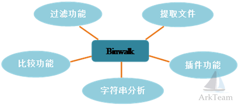

# binwalk

* `binwalk`
  * 是什么：固件分析工具
    * Firmware Analysis Tool
  * 一句话描述
    * 固件分析利器
      * 从固件中查找文件
    * a fast, easy to use tool for analyzing, reverse engineering, and extracting firmware images
  * 背景
    * 传统的固件分析：`file`
      * file缺点：占用了太多的磁盘来读写`I/O`，效率太低
    * `libmagic`动态库
      * 文件扫描的更好的解决方案
        * 核心4个函数
          * `magic_open`
          * `magic_close`
          * `magic_buffer`
          * `magic_load`
  * 基本功能
    * 图
      * 
    * 文字
      * 提取文件
      * 过滤功能
      * 比较功能
      * 字符串分析
      * 插件功能
  * 用途：
    * 路由器固件分析
    * 分析获取嵌入式设备的文件系统
  * 支持平台
    * `Linux`
    * `macOS`
    * `Cygwin`
    * `FreeBSD`
    * `Windows`
  * 资料
    * Github
      * ReFirmLabs/binwalk: Firmware Analysis Tool
        * https://github.com/ReFirmLabs/binwalk
    * 快速上手
      * Quick Start Guide · ReFirmLabs/binwalk Wiki
        * https://github.com/ReFirmLabs/binwalk/wiki/Quick-Start-Guide
    * 用法
      * Usage · ReFirmLabs/binwalk Wiki
        * https://github.com/ReFirmLabs/binwalk/wiki/Usage

## 举例

```bash
root@kali:~# binwalk -B ddwrt-linksys-wrt1200ac-webflash.bin 

DECIMAL       HEXADECIMAL     DESCRIPTION
--------------------------------------------------------------------------------
0             0x0             TRX firmware header, little endian, image size: 37883904 bytes, CRC32: 0x95C5DF32, flags: 0x1, version: 1, header size: 28 bytes, loader offset: 0x1C, linux kernel offset: 0x0, rootfs offset: 0x0
28            0x1C            uImage header, header size: 64 bytes, header CRC: 0x780C2742, created: 2018-10-10 02:12:20, image size: 2150281 bytes, Data Address: 0x8000, Entry Point: 0x8000, data CRC: 0xA097CFEA, OS: Linux, CPU: ARM, image type: OS Kernel Image, compression type: none, image name: "DD-WRT"
92            0x5C            Linux kernel ARM boot executable zImage (little-endian)
2460          0x99C           device tree image (dtb)
23432         0x5B88          xz compressed data
23776         0x5CE0          xz compressed data
2117484       0x204F6C        device tree image (dtb)
3145756       0x30001C        UBI erase count header, version: 1, EC: 0x0, VID header offset: 0x800, data offset: 0x1000
```

## help语法帮助信息

```bash
root@kali:~# binwalk -h

Binwalk v2.1.2
Craig Heffner, ReFirmLabs
https://github.com/ReFirmLabs/binwalk

Usage: binwalk [OPTIONS] [FILE1] [FILE2] [FILE3] ...

Signature Scan Options:
    -B, --signature              Scan target file(s) for common file signatures
    -R, --raw=<str>              Scan target file(s) for the specified sequence of bytes
    -A, --opcodes                Scan target file(s) for common executable opcode signatures
    -m, --magic=<file>           Specify a custom magic file to use
    -b, --dumb                   Disable smart signature keywords
    -I, --invalid                Show results marked as invalid
    -x, --exclude=<str>          Exclude results that match <str>
    -y, --include=<str>          Only show results that match <str>

Extraction Options:
    -e, --extract                Automatically extract known file types
    -D, --dd=<type:ext:cmd>      Extract <type> signatures, give the files an extension of <ext>, and execute <cmd>
    -M, --matryoshka             Recursively scan extracted files
    -d, --depth=<int>            Limit matryoshka recursion depth (default: 8 levels deep)
    -C, --directory=<str>        Extract files/folders to a custom directory (default: current working directory)
    -j, --size=<int>             Limit the size of each extracted file
    -n, --count=<int>            Limit the number of extracted files
    -r, --rm                     Delete carved files after extraction
    -z, --carve                  Carve data from files, but don't execute extraction utilities
    -V, --subdirs                Extract into sub-directories named by the offset

Entropy Options:
    -E, --entropy                Calculate file entropy
    -F, --fast                   Use faster, but less detailed, entropy analysis
    -J, --save                   Save plot as a PNG
    -Q, --nlegend                Omit the legend from the entropy plot graph
    -N, --nplot                  Do not generate an entropy plot graph
    -H, --high=<float>           Set the rising edge entropy trigger threshold (default: 0.95)
    -L, --low=<float>            Set the falling edge entropy trigger threshold (default: 0.85)

Binary Diffing Options:
    -W, --hexdump                Perform a hexdump / diff of a file or files
    -G, --green                  Only show lines containing bytes that are the same among all files
    -i, --red                    Only show lines containing bytes that are different among all files
    -U, --blue                   Only show lines containing bytes that are different among some files
    -w, --terse                  Diff all files, but only display a hex dump of the first file

Raw Compression Options:
    -X, --deflate                Scan for raw deflate compression streams
    -Z, --lzma                   Scan for raw LZMA compression streams
    -P, --partial                Perform a superficial, but faster, scan
    -S, --stop                   Stop after the first result

General Options:
    -l, --length=<int>           Number of bytes to scan
    -o, --offset=<int>           Start scan at this file offset
    -O, --base=<int>             Add a base address to all printed offsets
    -K, --block=<int>            Set file block size
    -g, --swap=<int>             Reverse every n bytes before scanning
    -f, --log=<file>             Log results to file
    -c, --csv                    Log results to file in CSV format
    -t, --term                   Format output to fit the terminal window
    -q, --quiet                  Suppress output to stdout
    -v, --verbose                Enable verbose output
    -h, --help                   Show help output
    -a, --finclude=<str>         Only scan files whose names match this regex
    -p, --fexclude=<str>         Do not scan files whose names match this regex
    -s, --status=<int>           Enable the status server on the specified port
```
