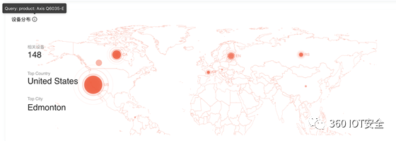
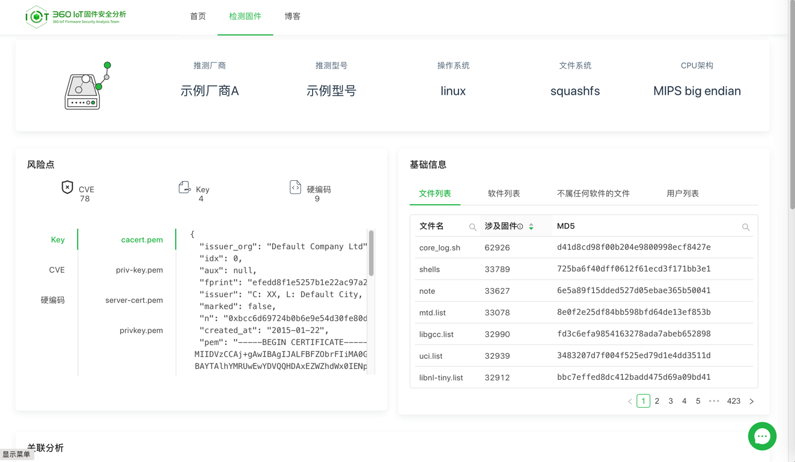
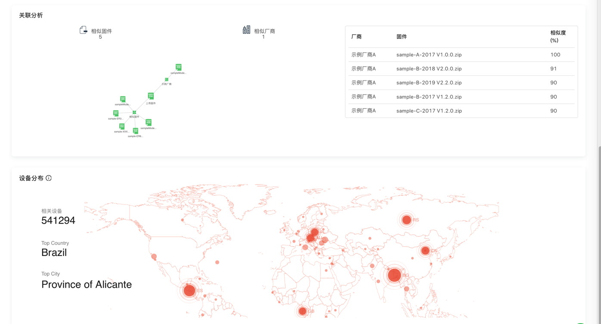

# FirmwareTotal

* FirmwareTotal
  * 是什么
    * 360安全研究院的多维数据关联分析平台
      * IoT固件自动化安全分析解决方案
  * 作用
    * 了解您的IoT固件是否存在安全问题
    * 支撑了追踪分析多起IoT 0-day 在野攻击事件，输出高级威胁情报
    * 支撑了对多起IoT/IIoT供应链漏洞传播安全事件的影响范围评估
  * 用途
    * What can Firmware Total do for you
      * 360安全大脑赋能
        * 基于360安全大脑的安全能力
      * 基于多攻击面的安全分析
        * 固件检测聚焦于与安全相关的指标
      * IoT漏洞特征库
        * 基于不断更新的IoT漏洞特征库
      * 软件供应链分析
        * 基于软件供应链的安全分析
      * 动态分析
        * 动态模拟IoT服务进行安全分析
      * 关联分析
        * 基于多维度的数据关联比对
  * 其他功能
    * IoT安全数据搜索引擎
      * 强大的IoT安全数据搜索引擎，发现更多隐藏的缺陷设备
    * IoT安全可视化关联分析
      * 基于IoT安全数据的可视化关联分析
    * IoT蜜罐模拟平台
      * 通过模拟IoT设备固件，可作为靶场或感知蜜罐
  * 用途举例
    * 对缺陷设备之一的Q6035-E的网络资产探测结果
      * 
    * https://ft.iotsec.360.cn/#/result?id=sample
      * 
      * 
