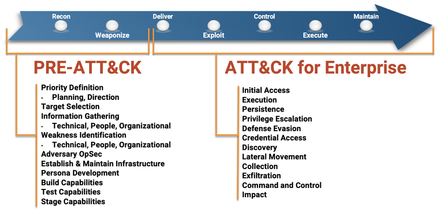
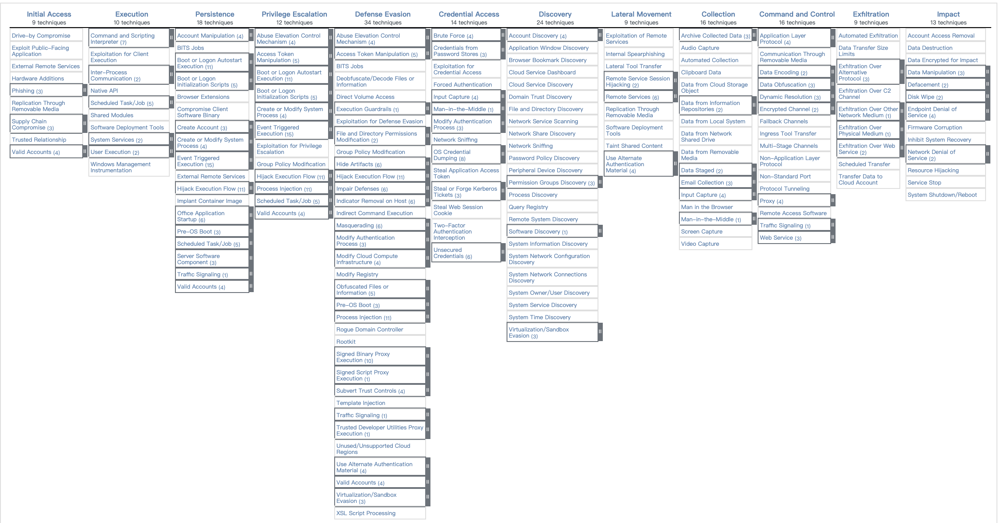
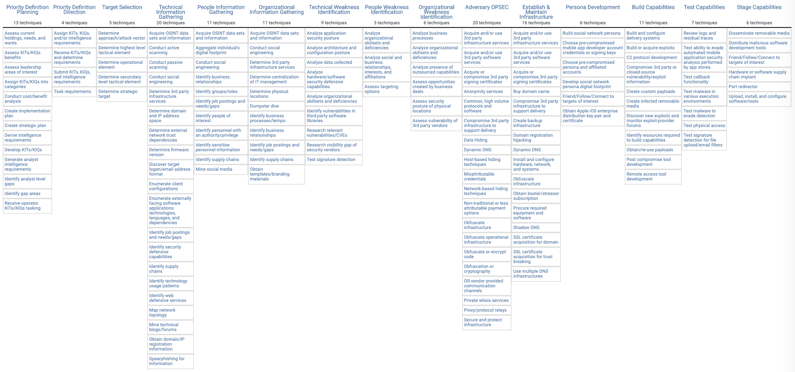
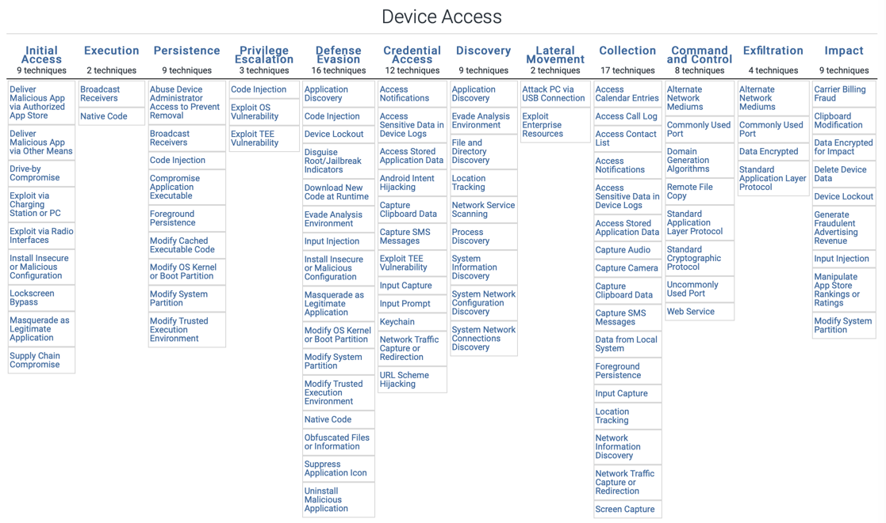
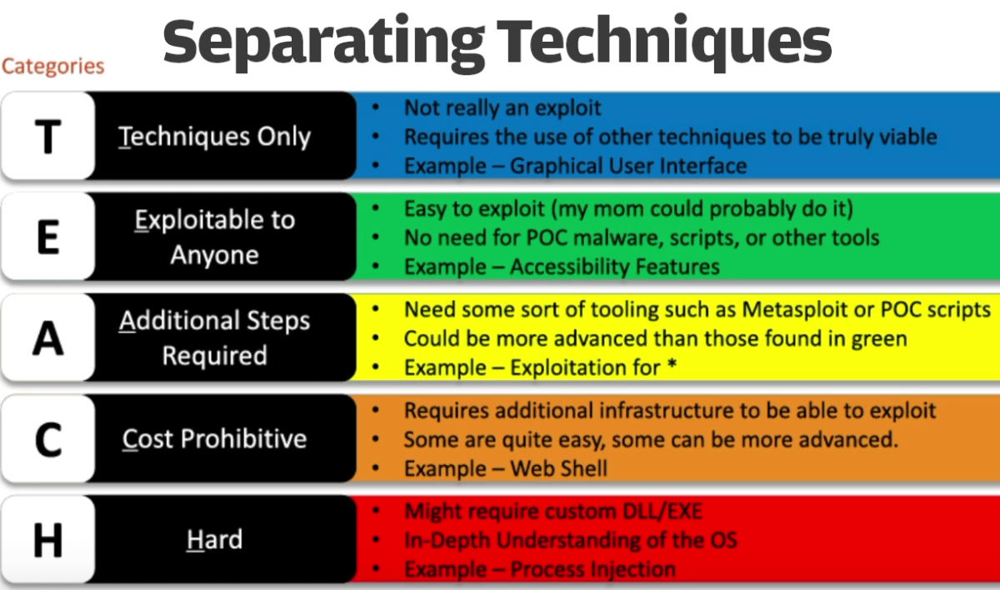
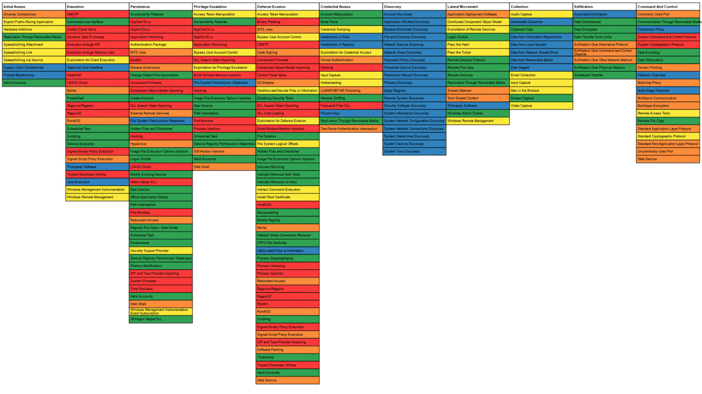

# ATT & CK

* ATT&CK
  * ATT&CK=Adversarial Tactics, Techniques & Common Knowledge
  * 一句话简介：MITRE ATT&CK 框架是打造检测与响应项目的流行框架
  * 是什么：一个模型
    * 总结概括了你的敌方可能尝试的战术和技术
  * 所属公司：MITRE
    * 所以全称是：MITRE ATT&CK Matrix
  * 呈现形式：一个大列表
  * 时间：2013年提出此概念
  * 细节介绍
    * 总体战术tactics
      * Initial Access
      * Execution
      * Persistence
      * Privilege Escalation
      * Defense Evasion
      * Credential Access
      * Discovery
      * Lateral Movement
      * Collection
      * Exfiltration
      * Impact
  * 分类
    * Enterprise ATT&CK = MITRE ATT&CK® Matrix for Enterprise
      * 介绍：ATT&CK for Enterprise is an adversary model and framework for describing the actions an adversary may take to compromise and operate within an enterprise network
      * 支持平台： 
        * Windows
        * macOS
        * Linux
        * Cloud
          * AWS
          * GCP
          * Azure
          * Azure AD
          * Office 365
          * SaaS
      * 矩阵
        * 概述
          * 
        * 细节
          * 
    * PRE-ATT&CK
      * 概述
        * 
    * Mobile ATT&CK
      * 概述
        * 
      * 支持平台
        * Android
        * iOS
  * 如何理解和使用
    * How to implement and use the MITRE ATT&CK framework | CSO Online
      * https://www.csoonline.com/article/3396139/how-to-implement-and-use-the-mitre-attandck-framework.html
        * 中文版
          * MITRE ATT&CK 框架“入坑”指南 - 安全牛
            * https://www.aqniu.com/learn/61125.html
      * 按照难度分
        * 
      * 加上难度颜色后，ATT&CK变成
        * 
