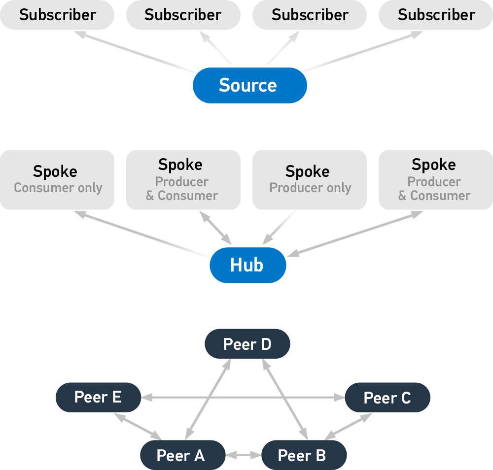

# STIX and TAXII

* STIX and TAXII
  * 是什么：标准standards
  * 目的：降低网络攻击和增强预防
    * STIX：描述了威胁情报有哪些
    * TAXII：介绍如何转发情报信息
  * 概述
    * 
  * 特点
    * machine-readable机器能识别
      * 容易自动化处理
  * STIX= Structured Threat Information eXpression
    * 一句话介绍：STIX, short for Structured Threat Information eXpression, is a standardized language developed by MITRE and the OASIS Cyber Threat Intelligence (CTI) Technical Committee for describing cyber threat information.
    * 应用现状：It has been adopted as an international standard by various intelligence sharing communities and organizations.
    * 使用方式：It is designed to be shared via TAXII, but can be shared by other means
    * 用途
      * STIX is structured in such a fashion that users can describe threat
        * Motivations
        * Abilities
        * Capabilities
        * Response
  * TAXII=Trusted Automated eXchange of Intelligence Information
    * 一句话描述：defines how cyber threat information can be shared via services and message exchanges
    * 作用：It is designed specifically to support STIX information, which it does by defining an API that aligns with common sharing models
    * 3种主要模型
      * Hub and spoke – one repository of information
      * Source/subscriber – one single source of information
      * Peer-to-peer – multiple groups share information
    * 4种服务
      * Discovery – a way to learn what services an entity supports and how to interact with them
      * Collection Management – a way to learn about and request subscriptions to data collections
      * Inbox – a way to recieve content (push messaging)
      * Poll – a way to request content (pull messaging)
    * 概述
      * 
