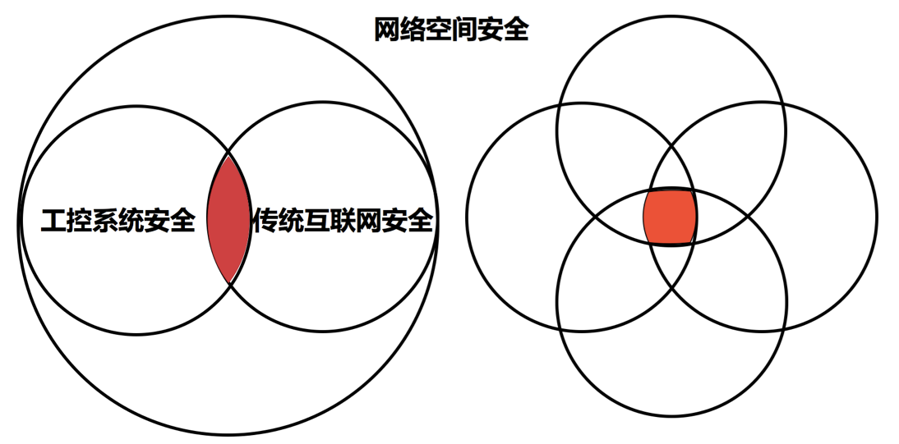
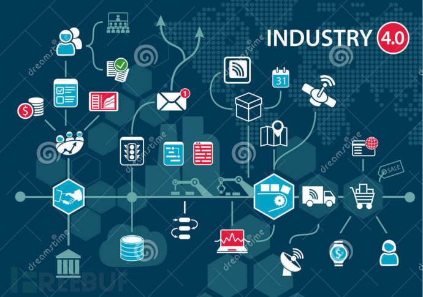
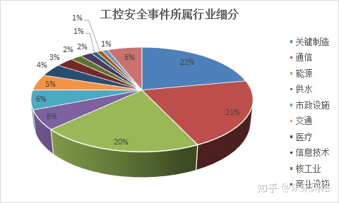
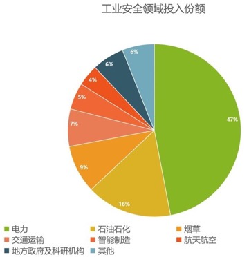
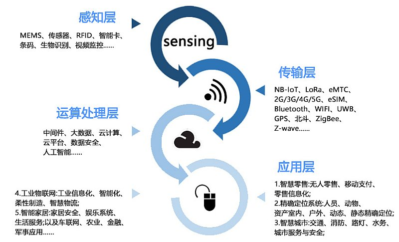
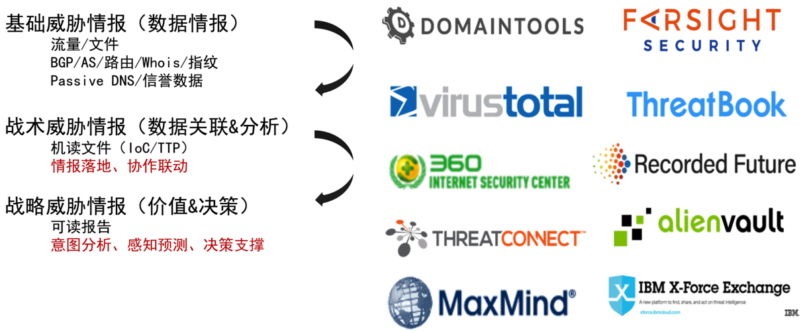
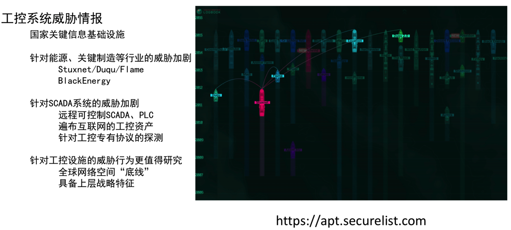

# 工控安全概览

* 工控安全和传统互联网安全关系
  * 
* 工控安全，即在工控领域的安全相关技术的统称
  * 工控，全称 工业控制
    * 工业，包含很多行业
      * 按照工业4.0
        * 抽象概念
          * 
      * 工业控制的细分领域众多
        * 据调查近年来工控安全事件涉及超过 15 个行业
          * 
        * 但目前工控市场安全只覆盖到了其中部分行业，要实现全面防护还有许多路要走
          * 
  * 物联网安全
    * 在和工控紧密相关的IoT物联网方面的安全，也被叫做：物联网安全
      * 一些最佳实践
        * 关闭任何不必要的开放端口
        * 消除任何不需要的可信接口
        * 在设备基础架构和设计团队中实施最小特权原则
        * 禁用默认密码
        * 正确使用加密
        * 根据情况考虑使用安全硬件
    * 以[IOTE2021国际物联网博览会](http://www.iote.com.cn)为例来说明，物联网包含了哪些层面的内容
      * 图
        * 
        * 
      * 文字
        * 物联网感知层
          * MEMS、传感器、RFID、智能卡、条码、生物识别、视频、监控（摄像头）
        * 网络传输层
          * NB-IoT、LoRa、eMTC、2G/3G/4G/5G、eSIM、Bluetooth、WIFI、UWB、GPS、北斗、ZigBee、Z-wave......
        * 运算处理层：
          * 中间件、大数据、云计算、云平台、数据安全、人工智能
        * 应用层
          * 1.智慧零售：无人零售、移动支付、零售信息化
          * 2.精确定位系统：人员、动物、资产室内、户外、动态、静态精确定位；
          * 3.智慧城市：交通、消防、路灯、水务、城市服务与安全；
          * 4.工业物联网：工业信息化、智能化、柔性制造、智慧物流；
          * 5.智能家居：家居安全、娱乐系统、生活服务；
          * 6.以及车联网、农业、金融、军事应用
      * 简单说，上述物联网内容，或多或少都和`物联网安全`、`工控安全`有所关联
* 工控安全的漏洞利用方法
  * 工控领域常见漏洞利用方式
    * `组态利用`
    * `通信劫持`
    * `Web渗透`

## 工控威胁和情报

### 相关机构及关系

* 基础威胁情报(数据情报)
  * 流量/文件
  * BGP/AS/路由/Whois/指纹
  * Passive DNS/信誉数据
* 战术威胁情报(数据关联&分析)
  * 机读文件(IoC/TTP)
  * 情报落地、协作联动
* 战略威胁情报(价值&决策)
  * 可读报告
  * 意图分析、感知预测、决策支撑

### 工控系统威胁情报

