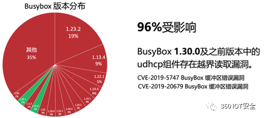
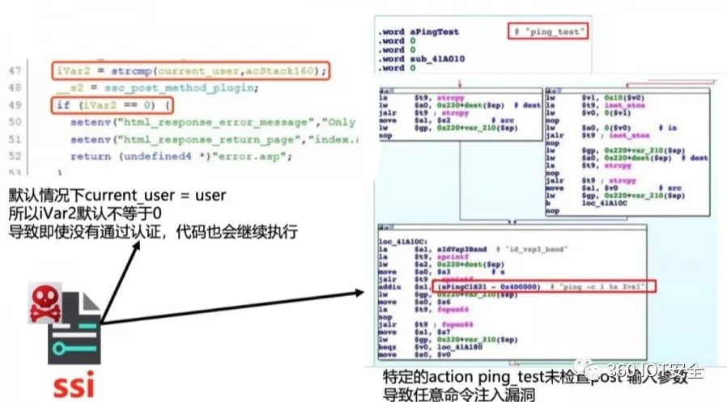
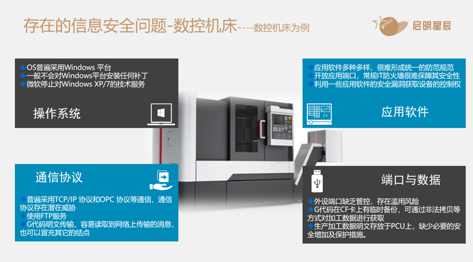
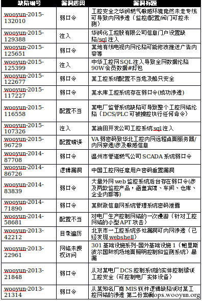
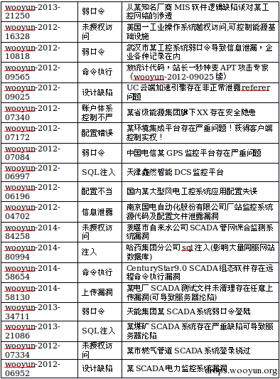
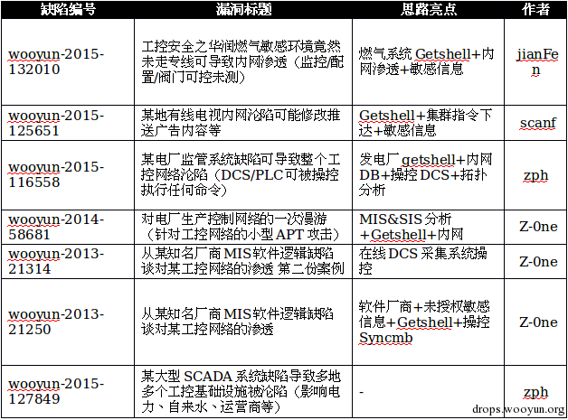

# 工控漏洞

* Busybox1.30.0
  * 2019 年Busybox1.30.0及之前版本存在的漏洞，包括CVE-2019-5747和CVE-2019-20679等。有非常多的固件使用了Busybox组件，并且大部分使用的都是1.30.0之前的版本。经过360安全研究院团队从数万个固件样本中统计，96%的固件都使用了1.30.0之前的版本
  * 这会导致各种类型的设备都受其影响，包括与GE医疗心电图分析系统密切相关的串口设备服务器、智能楼宇的自动化控制系统设备、工控系统中的RTU控制器以及工业安全路由器等
  * 
* D-Link
  * 2019年9月，集成自动化网络安全解决方案商Fortinet的FortiGuard Labs发现并向官方反馈了D-Link产品中存在的一个未授权命令注入漏洞（FG-VD-19-117/CVE-2019-16920）。攻击者可以利用该漏洞在设备上实现远程代码执行（RCE），且无需通过身份认证。该漏洞被标记为高危级别漏洞
  * 
* 数控机床
  * 

## 漏洞分析

### 乌云工控漏洞的分析

针对乌云主站的漏洞进行关键字搜索：工控(31)、SCADA(15)、Modbus(9)、PLC并进一步整合得到如下列表。

以上的漏洞列表中，可以得出如下结论：

* 乌云工控漏洞的案例中，绝大多起因是弱口令(弱口令最多的是123456，其次是admin)、注入类漏洞
* 能够挖出工控的精华漏洞的人也是特定的那几位，且在Kcon2015也有过演讲
* 挖掘此类漏洞主要解决两个问题
  * 如何找到工控相关的系统和地址
  * Getshell后，基于工控知识如何操控系统
* 根据漏洞中的细节可以进一步的复测和拓展，进而为工控系统的漏洞挖掘提供非线性思路
  * 结合GHDB关键字的搜素：例如`inurl:SCADA`等
  * 链接地址含SCADA、Modbus等协议的关键字等
  * 其他KEY：MIS、SIS、DCS、PLC、ICS、监控系统等
  * 相关公司：南京科远、金风科技、天能集团、国电南瑞、华润燃气、积成电子、重庆三峰、东方电子等

### 工控精华漏洞分析

乌云工控相关的精华漏洞如下7个，在思路亮点中分析了漏洞的核心，同样也可能是获得打雷精华的理由。几乎共同点均是操控了对应的工控系统

