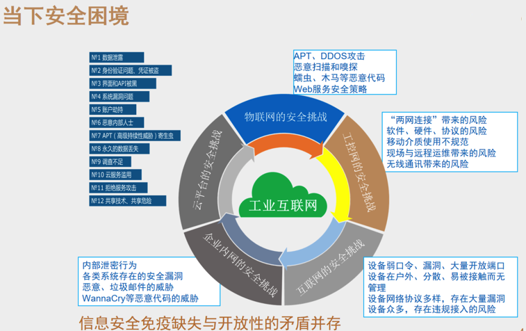
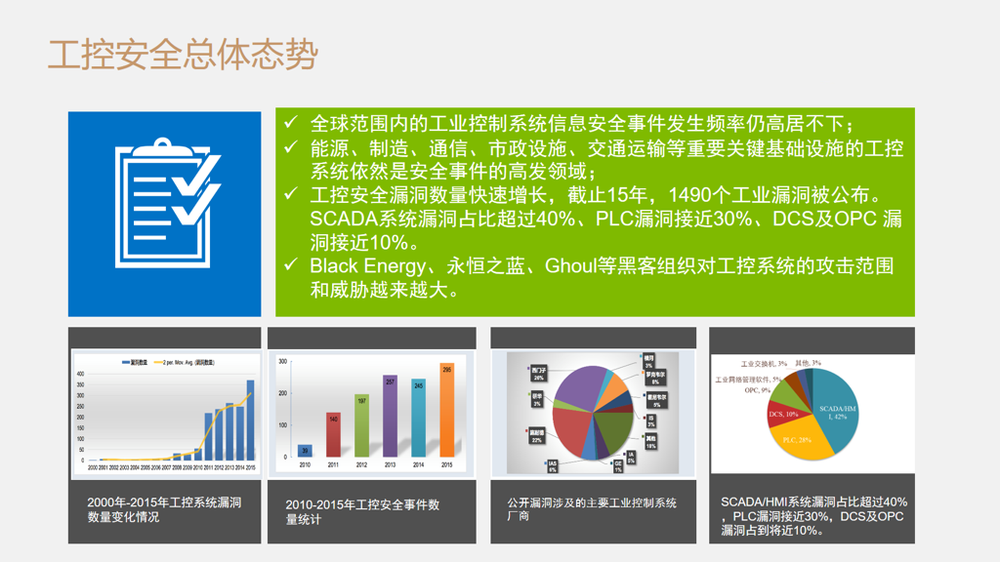

# 工控安全概览

如[信息安全概览](https://book.crifan.com/books/information_security_overview/website/)所总结，从技术领域分，信息安全大体可以分为：

* Web安全
  * =网络安全
* 移动端安全
* 工控安全

此处主要介绍工控领域内的安全：

* 工控安全，即在工控领域的安全相关技术的统称
  * 工控，全称**工业控制**
    * 工业，包含很多行业
      * 按照工业4.0
        * 抽象概念
          * 
      * 工业控制的细分领域众多
        * 据调查近年来工控安全事件涉及超过 15 个行业
          * 
        * 但目前工控市场安全只覆盖到了其中部分行业，要实现全面防护还有许多路要走
          * 
  * 工控安全和传统互联网安全关系
    * 
  * 工控安全概况
    * 
    * 

## 工控威胁和情报

### 相关机构及关系

* 基础威胁情报(数据情报)
  * 流量/文件
  * BGP/AS/路由/Whois/指纹
  * Passive DNS/信誉数据
* 战术威胁情报(数据关联&分析)
  * 机读文件(IoC/TTP)
  * 情报落地、协作联动
* 战略威胁情报(价值&决策)
  * 可读报告
  * 意图分析、感知预测、决策支撑

### 工控系统威胁情报

