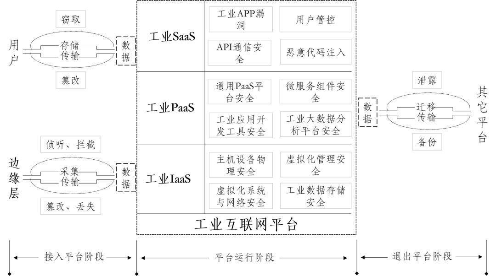

# 工业互联网安全

* 工业互联网安全
  * 标准体系
    * 设备
    * 控制
    * 网络
      * 含标识解析系统
    * 平台
    * 数据
  * 平台
    * 国家工业互联网安全技术保障平台
    * 基础资源库
    * 安全测试验证环境
  * 重点领域
    * 汽车
    * 电子信息
    * 航空航天
    * 能源
  * 构建
    * 安全管理制度
      * 安全监督检查
      * 风险评估
      * 数据保护
      * 信息共享和通报
      * 应急处置
  * 分层
    * 边缘层
    * IaaS层（云基础设施）
    * 平台层（工业PaaS）
    * 应用层（工业SaaS）
  * 安全
    * 标识解析系统安全
    * 平台安全
    * 工业控制系统安全
    * 数据安全
    * 5G安全
  * 产品研发
    * 攻击防护
    * 漏洞挖掘
    * 态势感知
  * 人才
    * 缺口很大
  * 涉及多学科
    * 工业控制与自动化
    * 电子信息通信
    * 网络安全
  * 内容
    * 工控漏洞挖掘
    * 安全威胁感知
    * 网络攻防对抗与安全防护
  * 平台和工具
    * 工业互联网攻防演练靶场
    * 仿真测试平台
    * 安全资源库、工具集
      * 工业协议库
      * 安全漏洞库
      * 恶意代码病毒库
      * 安全威胁信息库
      * 安全应急处置
      * 安全事件现场取证
  * 安全能力
    * 工业资产探查能力
    * 工业设备漏洞挖掘与检测能力
    * 工业控制协议深度解析能力
    * 攻击发现和阻断能力
    * 高级持续威胁（APT）发现和追踪溯源能力
    * 网络安全攻防对抗能力
    * 源代码安全检测能力
    * 工业云平台防护能力
    * 工业大数据安全防护能力
    * 安全态势感知平台建设能力
    * 大数据建模和分析处理能力
    * 功能安全与信息安全融合能力
  * 针对主机的攻击方式
    * 通过网络攻击取得工业主机管理权限，加密关键文件，进行勒索
    * 通过U盘对工业主机注入病毒篡改控制器上报数据，掩盖控制数据异常
    * 通过鱼叉攻击实现多台工业主机提权，篡改下发控制指令
    * 通过感染双网卡工业主机跨区传播计算机病毒
    * 通过被控制的工业主机向控制器下发网络风暴数据，造成控制器运行周期异常甚至死机
  * 标准
    * 等保2.0
    * 分保
  * 工业互联网平台架构
    * 概述
      * 
    * 工业互联网平台安全
      * 边缘层安全
      * 工业IaaS安全
      * 工业PaaS安全
      * 工业SaaS安全
      * 平台数据安全
  * 现状
    * 重视不足
      * 网络安全投入占IT投入比重
        * 美国：10%
        * 中国：2%
