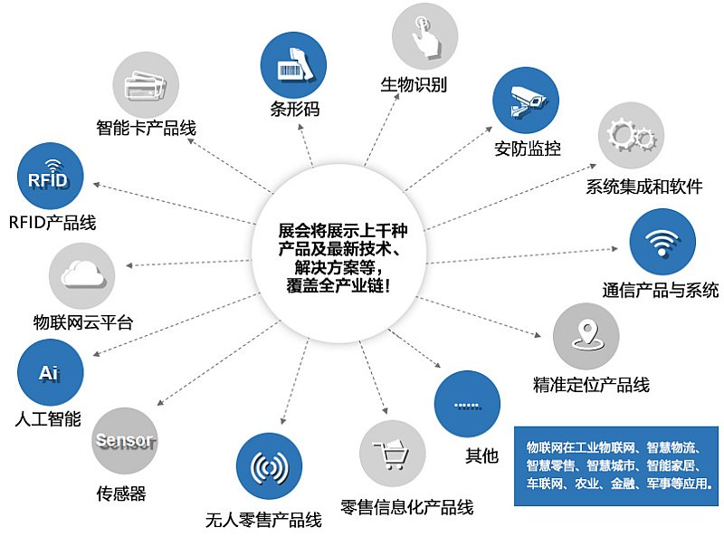

# 物联网安全

* 物联网
  * 名称
    * 传统叫法：工控领域
    * 最新叫法：物联网
      * 万物互联的时代
  * 含义
    * 联网的嵌入式设备
  * 常见设备
    * 包含
      * 摄像头、路由器、无人机、智能家居、工控设备等
    * 特点
      * 大多数安全性都较低
      * 头部厂商
        * D-Link
          * 产品：路由器、摄像头
          * 安全事件频发
            * 被美国联邦贸易委员会（FTC）起诉
            * 统计
              * 
        * Axis
          * 摄像头设备
            * 被曝出过多起安全事件
              * 影响
                * 水电站、原油储备基地等，也被应用于学校、商业会议中心、机场等领域
          * 举例
            * ACE-128401
            * ACV-120444
  * 包含内容
    * 以[IOTE2021国际物联网博览会](http://www.iote.com.cn)为例来说明，物联网包含了哪些层面的内容
      * 图
        * 
        * 
      * 文字
        * 物联网感知层
          * MEMS、传感器、RFID、智能卡、条码、生物识别、视频、监控（摄像头）
        * 网络传输层
          * NB-IoT、LoRa、eMTC、2G/3G/4G/5G、eSIM、Bluetooth、WIFI、UWB、GPS、北斗、ZigBee、Z-wave......
        * 运算处理层：
          * 中间件、大数据、云计算、云平台、数据安全、人工智能
        * 应用层
          * 1.智慧零售：无人零售、移动支付、零售信息化
          * 2.精确定位系统：人员、动物、资产室内、户外、动态、静态精确定位；
          * 3.智慧城市：交通、消防、路灯、水务、城市服务与安全；
          * 4.工业物联网：工业信息化、智能化、柔性制造、智慧物流；
          * 5.智能家居：家居安全、娱乐系统、生活服务；
          * 6.以及车联网、农业、金融、军事应用
      * 简单说，上述物联网内容，或多或少都和`物联网安全`、`工控安全`有所关联
  * 物联网安全
    * 在和工控紧密相关的IoT物联网方面的安全，也被叫做：物联网安全
    * 一些最佳实践
      * 关闭任何不必要的开放端口
      * 消除任何不需要的可信接口
      * 在设备基础架构和设计团队中实施最小特权原则
      * 禁用默认密码
      * 正确使用加密
      * 根据情况考虑使用安全硬件
