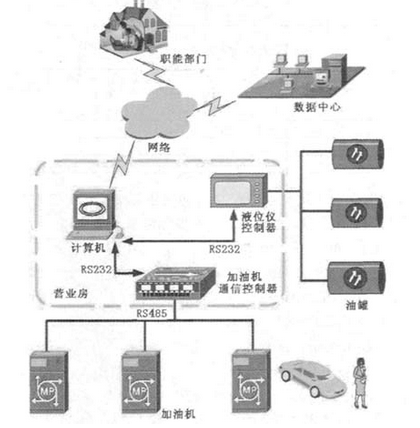

# ATG

* ATG
  * =油罐液位仪=加油站液位仪
  * 是什么：一种储油罐的监测设备
  * 现状
    * 全球有高达5800多站点的设备接入了互联网
    * 其中5300多位于美国
    * 仪表主要供应商为维德路特（Vedeer-Root）
    * 仪表设备经由串转网（串口转以太网）的方式接入互联网（主要用于运营商远程监控数据）
      * 因为设备协议上没有认证
        * 攻击者可以轻易通过网络更改仪表的门限和阀值、产生警报等引起安全事故
  * 加油站监测的系统结构图
    * 

