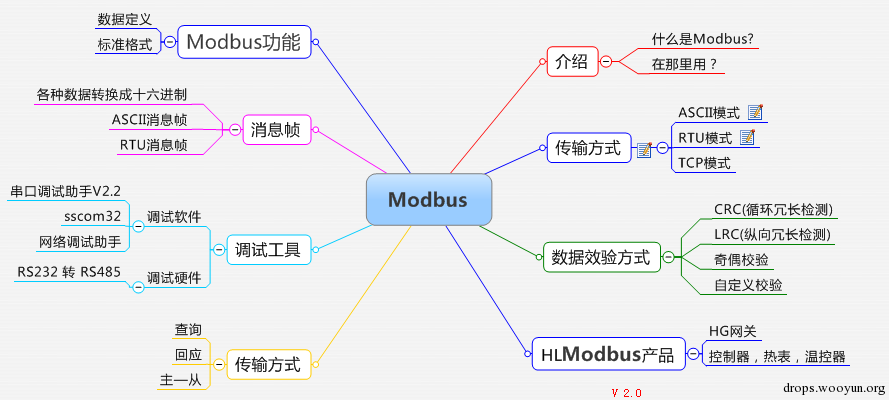

# Modbus

* `Modbus`
  * MODBUS协议定义了一个与基础通信层无关的简单协议数据单元（PDU）。特定总线或网络上的MODBUS协议映射能够在应用数据单元（ADU）上引入一些附加域。
  * 
  * 安全问题：
    * 缺乏认证：仅需要使用一个合法的Modbus地址和合法的功能码即可以建立一个Modbus会话
    * 缺乏授权：没有基于角色的访问控制机制， 任意用户可以执行任意的功能。
    * 缺乏加密：地址和命令明文传输， 可以很容易地捕获和解析
