# Modbus

* `Modbus`
  * MODBUS协议定义了一个与基础通信层无关的简单协议数据单元（PDU）。特定总线或网络上的MODBUS协议映射能够在应用数据单元（ADU）上引入一些附加域。
  * 
  * 安全问题：
    * 缺乏认证：仅需要使用一个合法的Modbus地址和合法的功能码即可以建立一个Modbus会话
    * 缺乏授权：没有基于角色的访问控制机制， 任意用户可以执行任意的功能。
    * 缺乏加密：地址和命令明文传输， 可以很容易地捕获和解析

* Modbus=Modbus协议
  * 历史和背景
    * Modicon公司1979年发行
    * 工业控制已从单机控制走向集中监控、集散控制，如今已进入网络时代，工业控制器连网也为网络管理提供了方便
    * Modbus 就是工业控制器的网络协议中的一种
    * 2004年，中国国家标准委员会正式把Modbus作为了国家标准，开启了Modbus为中国工业通信做贡献的时代
  * 现状
    * 已经被广泛应用于工业控制现场的应用层协议
      * 监控和控制现场设备
  * 协议
    * 概述
      * 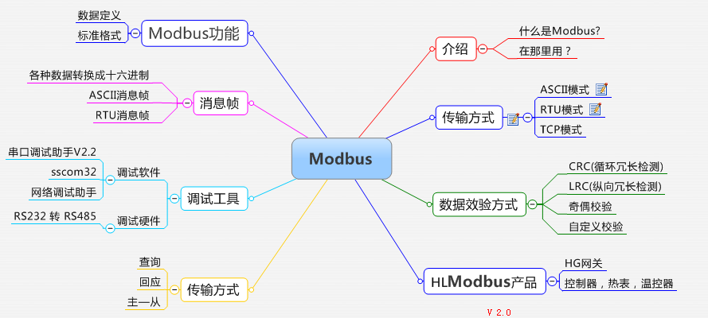
    * 种类
      * 串口上的：Modbus Serial协议

      * TCP/IP 以太网上 上的：Modbus TCP协议=Modbus/TCP协议

## Modbus Serial协议

* Modbus Serial协议
  * 解释
    * 在物理层面上选择串口进行简单的串行通信
    * 最初是为了实现串行通信，运用在串口（如RS232、RS485、RS422 等）传输上的，分为ModbusRTU、Modbus ASCII两种
    * Modbus协议最初是通过串行数据进行通信的，也就是Modbus Serial协议
  * 包含
    * Modbus ASCII
      * 特点
        * 通讯是普通文本=ASCII ？
      * Modbus ASCII 常用的报文格式
        * 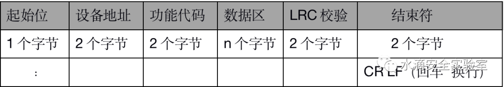
    * Modbus RTU
      * RTU=Remote Terminal Unit
        * RTU通信就是通过模拟远程终端设备读写寄存器
      * 特点
        * 通讯是二进制 ?
      * Modbus RTU 常用的报文格式
        * 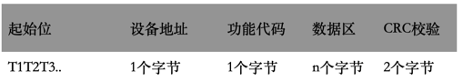
  * 架构
    * 一主多从架构
      * 主站发起请求，从站负责响应

## Modbus TCP协议

* Modbus TCP协议
  * 协议栈
    * Modbus TCP一种应用层消息传递协议，位于OSI模型的第7级
    * 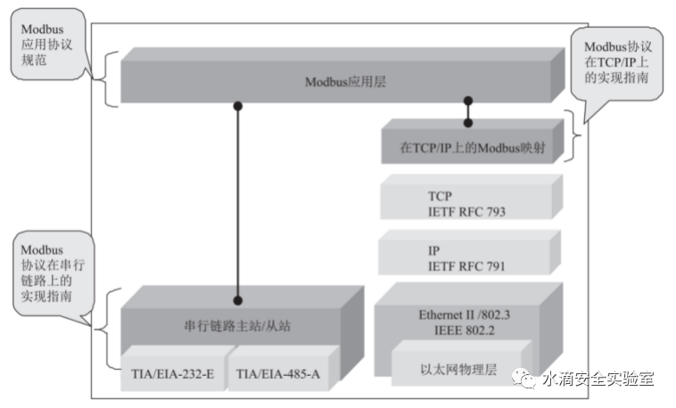
    * 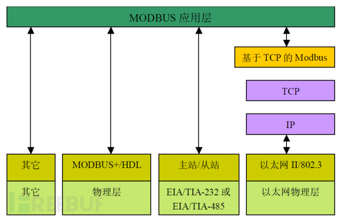
    * 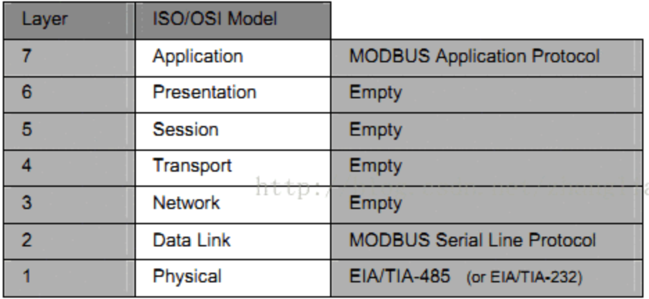
  * 协议细节
    * 帧格式
      * 两种帧格式
        * 802.3
        * Ethernet II
    * 数据帧
      * 概述
        * 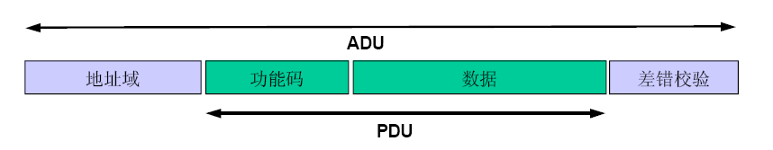
        * 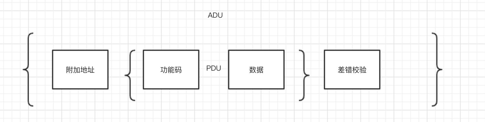
        * 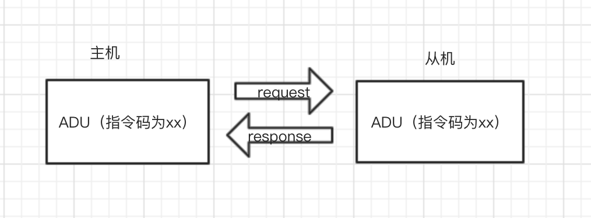
      * 包含
        * MBAP 报文头
          * 4 分内容， 7 个字节
          * 报文格式
            * 图
              * 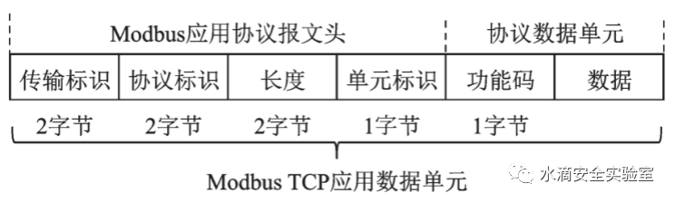
            * 举例
              * Modbus/TCP
                * Transaction Identifier: 89 //数据包序号
                * Protocol Identifier: 0 //数据协议类型
                * Length: 9 //Modbus协议长度
                * Unit Identifier: 1 //目的设备ID
              * Modbus
                * Function Code: Write Multiple Coils (15) //功能码
                * Reference Number: 0 //线圈储存当前地址偏移量
                * Bit Count: 10 //一共10位
                * Byte Count: 2 //以两个字节发送
                * Data: c403 //按位转为16进制的多线圈数据
            * 包含
              * 传输标识
                * 2 个字节
                * 传输中的序列号
                * 生成该序列号的对应的传输形式是 Query
                * 响应是复制该序列号就是 Response
              * 协议标识
                * 2 个字节
                * 采用 Modbus 时为 0 （即 00 00 ）
                * 采用 UNI-TE 时为 1
              * 后续字节长度
                * 2个字节
                * 代表后续字节数
              * 单元标识
                * 1个字节
                * 代表 Modbus RTU 中的地址码
            * 举例
              * 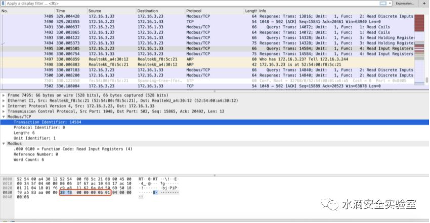
                * 上图中 MBAP
                  * 传输标识： 38 f8
                  * 协议标识：Modbus 协议为 00 00
                  * 后续字节长度为 00 06 后续有 6个字节长度
                  * 单元表示为 01 ，代表查询 RTU 的地址码为 01
        * 功能码
          * 1个字节
          * 分类
            * 按照用途分3类
              * 概述
                * 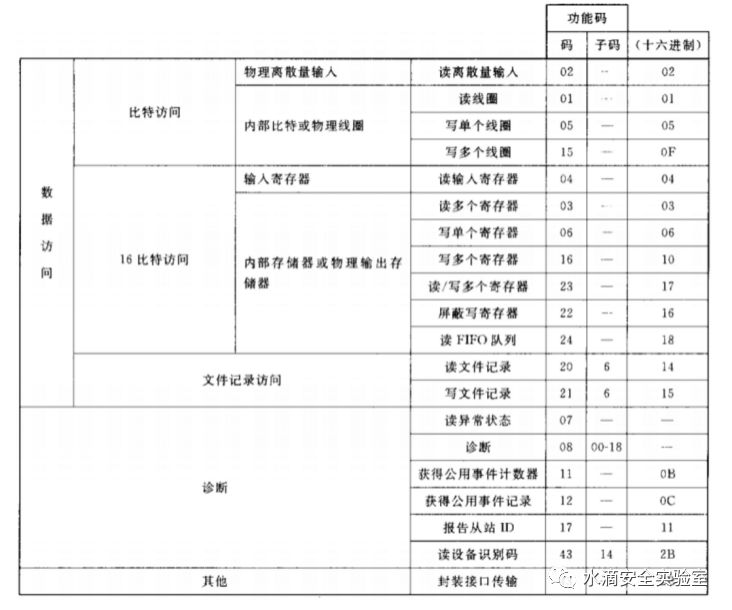
              * 包含
                * 公共功能码
                  * 为已被定义好的一致的、唯一的、公开的功能码
                * 用户自定义功能码
                  * 为用户自行定义的功能码，在区间 65-72 和 100-110
                * 保留功能码
                  * 留作扩展功能备用 22-64 ，留作内部作用 120-127 ，留作异常应答 128-255
              * 举例
                * 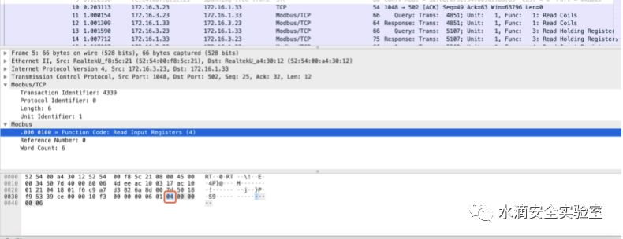
                  * Modbus 流量中的 04 读输入寄存器功能码
        * 数据
  * 解释
    * 使用TCP的方式进行传输
    * 随着工业现代化的发展，产生了Modbus TCP协议，即通过与TCP协议相结合来发送和接收Modbus Serial数据。
    * 后来施耐德电气将该公司收购，并在1997年推出了基于TCP/IP的Modbus TCP。现在使用最多的就是Modbus TCP了
    * Modbus的协议栈仅仅是在传统ISO/OSI模型的基础上对数据链路层和应用层做了定义
  * 应用
    * 广泛应用于电力、水力等工业系统
  * 漏洞
    * 产生机制
      * 正是因为modbus是应用层的协议，所以它的安全漏洞并不只是它本身，TCP/IP的漏洞也可以利用在modbus上
    * 案例
      * 最典型的就是18年工控比赛的题目，中间人
  * 架构
    * 主从架构
      * 举例
        * Master：HMI=人机界面，监控系统等
        * Slave：PLC
      * 或
        * Master：主PLC
        * Slave： PLC 、 HMI 、 I/O设备、传感器、执行器，电表、仪表等
  * 部署
    * 典型的部署方式
      * 在 SCADA 区域使用 Modbus TCP 对主 HMI 和主 PLC集中管理
      * 各 PLC 则通过总线拓扑串联多个 PLC 、 HMI 和 RTU 等
  * 协议 报文 细节
    * PDU=Protocol Data Unit=协议数据单元
    * ADU=数据单元
      * 与基础网络无关
    * ASCII模式
      * 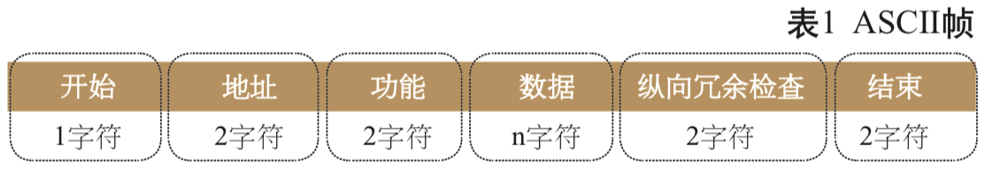
    * RTU模式
      * 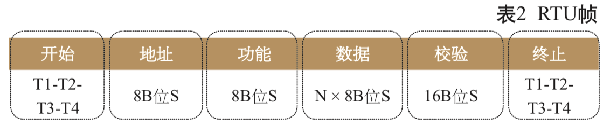
    * 通用消息帧
      * 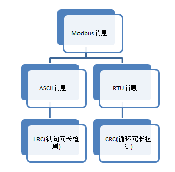
  * modbus功能码
    * 概述
      * 通过功能码主设备能够对从设备下达指令
      * 功能码有效范围：1~255
    * 公共功能码分类
      * 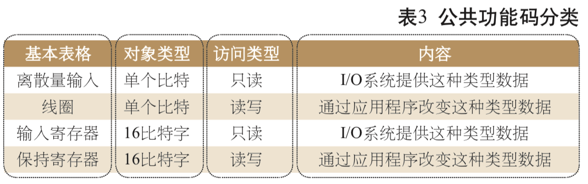
    * 公共功能码定义
      * 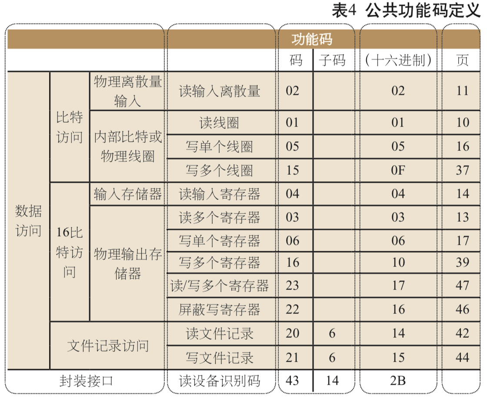
    * 举例
      * 01 读线圈状态
      * 02 读离散输入状态
      * 03 读保持寄存器
      * 04 读输入寄存器
      * 05 写单个线圈
  * 使用分布
    * SHODAN搜集协议使用分布区域的动态立体图
      * Shodan - ICS Radar
        * https://ics-radar.shodan.io
          * 
  * 安全方面
    * Modbus的出现是为了使工业现场设备实时地接收和发送相关命令和数据，然后最重要的安全措施在Modbus的设计之初并没有被考虑进去
    * 原因：
      * Modbus TCP 协议设计时，考虑的应用场景是外界隔离的工业以太网，更多的考虑的是 Modbus TCP 协议的可靠性、实时性和传输效率，基本没有考虑协议的安全性
  * Modbus协议缺陷
    * 没有认证机制
      * 缺乏认证导致攻击者容易获取 Modbus TCP 信息，并且攻击者只要使用有效的功能码和地址，就可以冒充主控端操控 Modbus 设备
    * 传输内容没有加密
      * 直接以明文的形式传输命令和地址，能够被攻击者轻易捕获、解析和重放，目前已经有了 N-Modbus TCP 协议基于 SSL 解决这个问题，但是传输效率降低
    * 可编程性
      * Modbus 协议的 salve 端多为可编程逻辑控制单元，攻击者发出的恶意攻击代码可以直接控制 PLC 或者 RTU 等工控设备
  * Modbus攻击面=攻击方式
    * 通过扫描的方式
      * 获取网络中主 / 从设备的地址、开放端口等信息。嗅探网络中的数据包，获取控制指令、设备参数等工业敏感信息。
    * 前期通过公网渗透进入工业网络环境中后，模拟主 / 从设备发送恶意指令，造成设备错误操作，破坏工控流程
      * 例如：在攻击者得到主从设备的网络配置后，仿冒主设备的地址信息，构造功能码令从设备强制重启；构造功能码修改寄存器的值，导致控制器做出错误决策；
    * 模拟从设备给主设备发送错误码，致使主设备判断逻辑发生错误
      * 例如：攻击者模拟某个 PLC 给从设备发送 04 错误码，告诉主设备从设备故障，如果此时主设备的顶层逻辑是启用备份设备，对于某些压力工厂风险是巨大的。
        * 错误码
          * 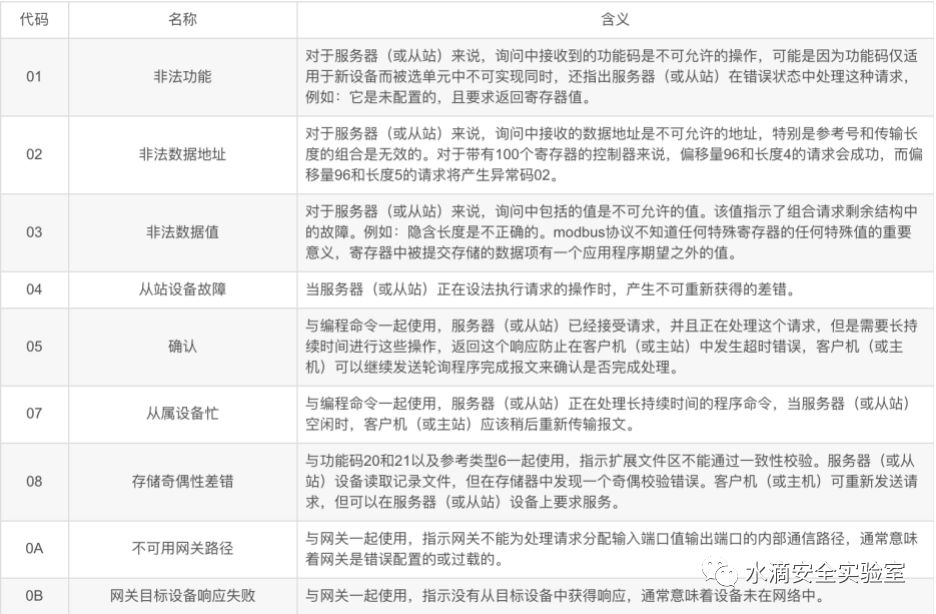
  * 安全问题=漏洞
    * 包含
      * 拒绝服务Dos攻击
      * 远程代码执行
      * 堆栈缓冲区溢出
      * 中间人攻击
        * 传统TCP/IP存在的问题
          * 举例
            * 18年的中间人攻击
      * 其他操作
        * 读写线圈和寄存器
    * 举例
      * 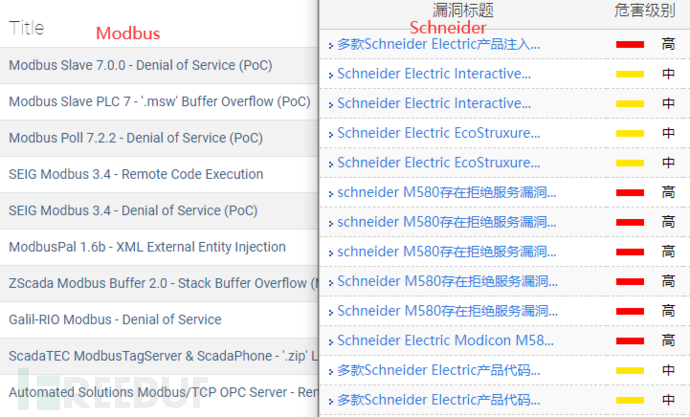
    * 具体案例
      * 工控安全入门（一）—— Modbus协议 - 安全客，安全资讯平台
        * https://www.anquanke.com/post/id/185513
          * 2019工控安全比赛 线上赛第一场 Modbus题目（第一版）
            * 19年的第一版，施耐德的高危功能码，这是非常难的
              * 从之前的分析可以看到这些保留的功能码在厂商自定义后对于我们普通的参赛选手来说是很难真正读懂流量包的，需要配合相应的正向使用知识，和正向使用的流量包来进行学习
          * 2019工控安全比赛 线上赛第一场 Modbus题目（第二版）
      * Modbus在施耐德设备上的一个重要漏洞
        * defcon上展示过的fun with 0x5a
          * 
      * Modbus题目解析
        * Modbus协议与S7Comm协议浅析 - Sec' Hotspot
          * https://sec.thief.one/article_content?a_id=186aecd7d905fd606076bc50e51919db
            * 黑客通过外网进入一家工厂的控制网络，之后对工控网络中的操作员站系统进行了攻击，最终通过工控协议破坏了正常的业务。我们得到了操作员站在攻击前后的网络流量数据包，我们需要分析流量中的蛛丝马迹，找到FLAG

## Modbus工具

* Smod
  * 简介
    * 一个模块化的Modbus渗透测试框架，可以用来测试Modbus协议所需的各种诊断和攻击功能。这是一个使用Python和Scapy的完整的Modbus协议实现。
  * 支持系统： Linux / OSX
  * 版本：python 2.7.x
  * 模块
    * modbus-discover.nse（nmap自带）识别并发现Modbus PLCS设备及版本
    * modicon-info.nse（需添加）识别并列举Schneider Electric Modicon PLC
    * modbus-enum.nse （需添加）识别并枚举使用Modbus的设备
  * 功能
    * 暴力破解PLC的UID
    * 网络嗅探进行ARP地址欺骗
    * 枚举Modbus PLC的功能
    * 模糊读写单一或多个线圈功能
    * 模糊读写单一或多个输入寄存器功能
    * 测试读写单一或多个保持寄存器功能
    * 测试单个PLC 所有功能
    * 对单个或多个线圈写值进行Dos攻击
    * 对单个或多个寄存器写值进行Dos攻击
    * 对ARP地址欺骗进行Dos攻击
  * 命令
    * show modules
      * 查看有哪些功能模块
    * use /modbus/scanner/uid
    * /modbus/scanner/getfunc
* Modbus Poll/Salve模拟器
  * 包含组件
    * 服务端模拟器Modbus Poll(可设置虚拟IP 地址，常用请求功能码，任意大小的内存)
      * 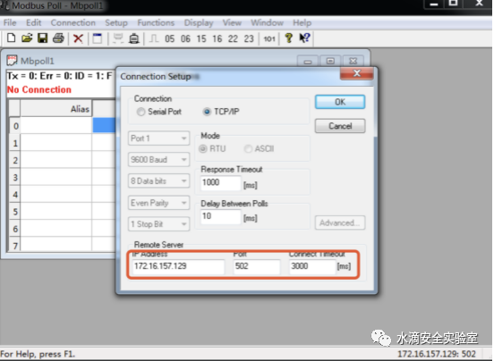
      * 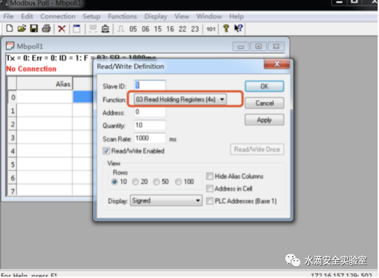
    * 客户端模拟器Modbus Slave
      * 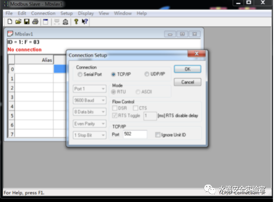
    * Modbus_RSsim(可读取协议数据段数据)
* ISF
  * 相关
    * 【整理】工控系统渗透方法和工具
  * 其中就有
    * plc相关的扫描
      * 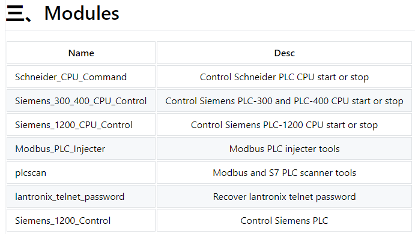

## 相关

* SummerySCADA
  * 过程控制网络
* 常见PLC
  * Schneider（施耐德）PLC M340
    * 简介
      * Modicon M340是全球能效管理专家施耐德电气于2007年推出的高性能中型PLC平台，拥有“精巧、可靠、创新、易用、高性价比”等诸多新亮点，适用于中小型项目、复杂机械及过程装备
    * 图
      * 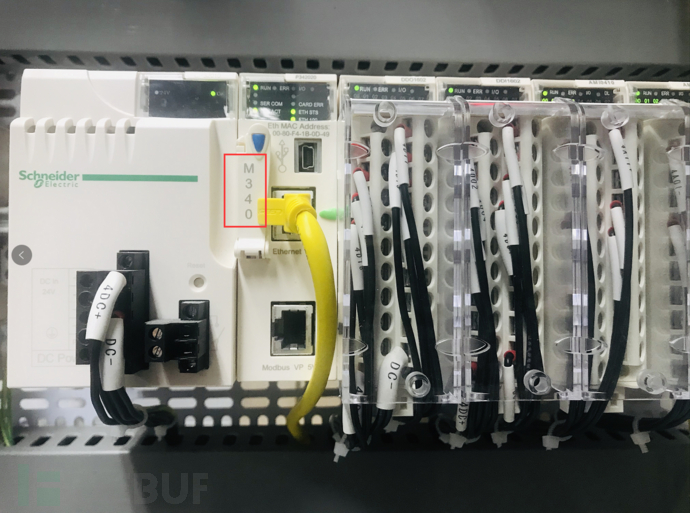
    * 上位机编程软件：EcoStruxure Control Expert
      * 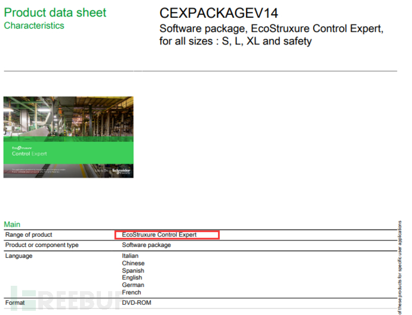
      * 主站
        * 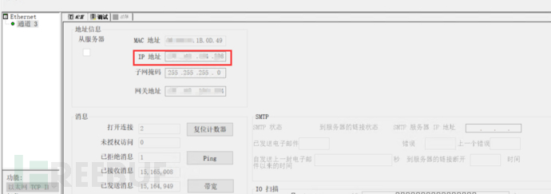
      * 从站
        * 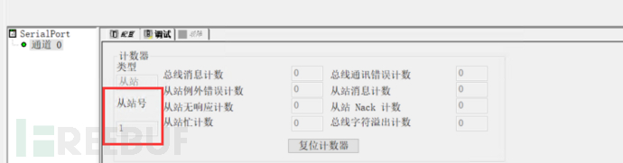
  * 西门子 S7系列
    * 上位机编程软件：博途
* 串口工具
  * 虚拟串口工具
    * VSPD=Virtual Serial Port Driver
      * 9.0 by Eltima Software
  * 串口调试工具的使用
    * 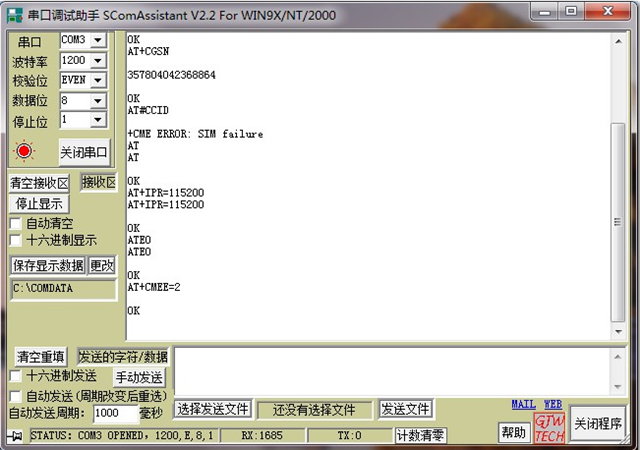
    * 串口调试工具 + RS485
      * 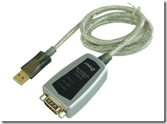
      * 
    * 网络调试助手
      * 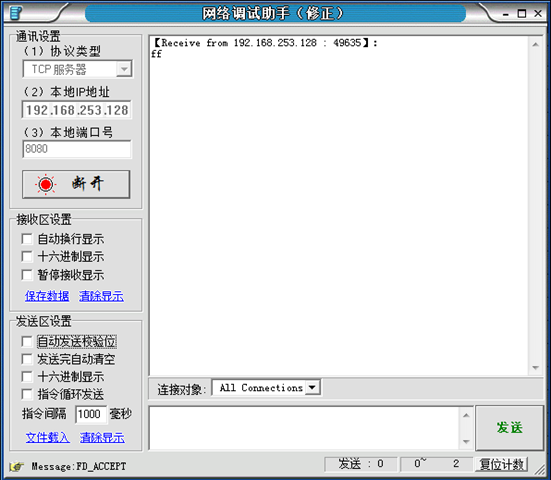
* Python
  * Python的modbus_tk库
* 防御
  * 建议：一个Modbus协议系统里需要多层次的安全防御手段
  * 手段
    * 流量异常行为检测
    * 身份认证和授权
      * 只有可信任的设备，才能接入工控系统网络，且需要进行身份认证，确保登陆者也是可信任者
        * 背景
          * modbus根本没有认证方面的定义，攻击者需要的仅仅是一个合适的ip地址而已，至于授权更是无从谈起，加密方面也是漏洞百出
    * 日志记录和安全审计
      * 记录操作的时间、地点、操作者和操作行为等关键信息从而提供安全事件爆发后的追查能力
    * （企业）要定期对工控系统进行漏洞扫描
      * 及时修补漏洞更新软硬件
    * 安全设计
      * 需要注意 功能码滥用
* 由Modbus从设备提供给Modbus主设备的对象类型

| Object type | Access | Size | Address Space |
| ----------- | ------ | ---- | ------------- |
| 线圈Coil | Read-write | 1 bit | 00001 - 09999 |
| 离散输入Discrete input | Read-only | 1 bit | 10001 - 19999 |
| 输入寄存器Input register | Read-only | 16 bit | 30001 - 39999 |
| 保持寄存器Holding register | Read-write | 16 bit | 40001 - 49999 |
