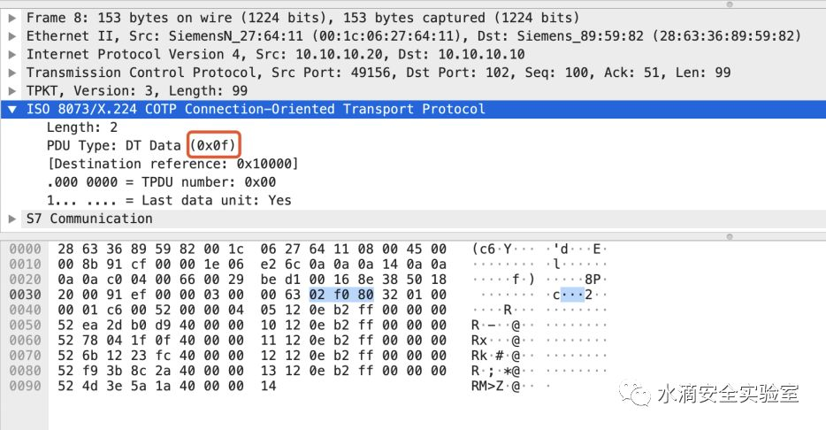

# Siemens S7

* `S7Comm`协议
  * 介绍
    * 德国西门子公司生产的`PLC`与`SCADA`系统进行通信的私有协议
    * `S7`被封装在`TPKT`和`ISO-COTP`协议中，基于 TCP 协议， S7 的协议传输单元能够通过 TCP 传送
  * 协议栈
    * 
  * `TPKT`协议层
    * 会话层的 TPKT 协议是应用程序数据传输协议，介于 TCP 协议和 COTP 协议之间， windows 常用的远程桌面协议 RDP 也是基于 TPKT ， S7 协议的会话层 TPKT 协议默认 TCP 端口是 102
    * PKTP协议wireshark协议栈
      * 
      * 一共四个字节：
        * Version ，一个字节，版本信息
        * Reserved ，一个字节，保留字段
        * Length ，两个字节，包括当前 4 个字节在内的后续 TCP payload 的字节长度
  * `COPT`协议层
    * COPT 协议（面向连接的传输协议），在传输数据前需要进行握手确立连接，所以 COPT 协议有两种包， COPT 连接包（握手包）和 COPT 功能包。
    * COPT 协议栈里面 PDU 类型为连接请求（ 0x0e ），表示该数据包是一个连接请求包 ， PDU 类型为连接请求（ 0x0 d ），表示该数据包是一个连接响应包
    * COPT 协议栈 PDU 类型码表
      * 
    * S7Comm 数据传输数据包
      * 
      * 上图的 PDU Type 为 0x0f ，表明是数据传输的数据包
  * `S7Comm`协议层
    * `S7Comm`协议包括三个部分：
      * Header
        * ROSCTR
          * 常见值
            * 0x01 ： JOB 即作业请求，如，读 / 写存储器，读 / 写块，启动 / 停止设备，设置通信
            * 0x02 ： ACK 即确认相应，这是一个没有数据的简单确认
            * 0x03 ： ACK_DATA 即确认数据相应，一般是响应 JOB 的请求
            * 0x07 ： USERDATA 即扩展协议，其参数分段包含请求 / 响应 ID ，一般用于编程 / 调试，读取 SZL 等
      * Parameter
      * Data
    * 举例
      * 功能码为 0x05 的 S7Comm 数据包
        * 
        * 含义解析
          * Header：
            * 第一个字节是协议标识符 0x32
            * ROSCTR：1
              * ROSCTR 这个字段的取值决定后面 PDU 的结构，这里我们只分析取值为 0x01-JOB ，作业请求
                * 由主设备发送的请求（例如，读 / 写存储器，读 / 写块，启动 / 停止设备，设置通信）。
          * Parameter
            * S7Comm 当 ROSCTR 取值为 0x01 时，协议栈中的 Parameter 项的第一个字段是 function （功能码），大小为 1 字节
            * 功能码为 0x05 的 S7Comm 数据包查询功能码表可以确定这个数据包是写入值
              * 整理常见的 JOB 和 Ack_data 的功能码表
                * 
          * data
            * 因此 Write Var 中Parameter 的结构后面要添加写入值的内容，多了一个 data 项
            * data 的结构
              * 0 (Unsigned integer, 1 byte): Return code ，返回代码
              * 1 (unsigned integer, 1 byte): Transport size ，确定变量的类型和长度
              * 2-3 (unsigned integer, 2 bytes): Length ，写入值的数据长度
              * 4 (1 byte): Data ，写入的值
              * 5 (unsigned integer, 1 byte): Fill byte ，填充字节，如果数据的长度不足 Length 的话，则填充